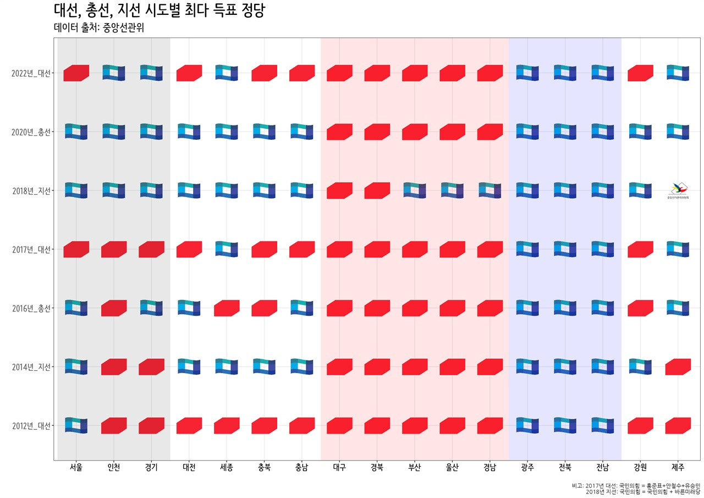

  
  


---
output: html_document
editor_options: 
  chunk_output_type: console
---

들어가며
================================================================================


Column {.tabset .tabset-fade}
-------------------------------------------------------------------------------

<br>
<br>

### 세계속의 경기도


```
Error in path.expand(path): 인자 'path'가 올바르지 않습니다.
```


역대 시도 선거 {data-icon="icon-dashboard"}
=====================================  


Column {.tabset .tabset-fade}
-------------------------------------------------------------------------------

### [종합](http://www.ohmynews.com/NWS_Web/View/at_pg_w.aspx?CNTN_CD=A0002820588)


{width=100%}


### '22년 대선

{width=100%}

### '20년 총선


{width=100%}


### '18년 지선


{width=100%}


### '17년 대선


{width=100%}

### '16년 총선


{width=100%}

### '14년 지선


{width=100%}

### '12년 대선


{width=100%}


<!-- 투표율 -->


투표율 {data-icon="ion-stats-bars"}
=====================================  


Column {data-width=200}
-------------------------------------

### 구시군


```
Error: package or namespace load failed for 'sf' in dyn.load(file, DLLpath = DLLpath, ...):
 공유된 객체 '/usr/local/lib/R/4.1/site-library/sf/libs/sf.so'를 로드 할 수 없습니다:
  dlopen(/usr/local/lib/R/4.1/site-library/sf/libs/sf.so, 6): Library not loaded: /usr/local/opt/proj/lib/libproj.22.dylib
  Referenced from: /usr/local/lib/R/4.1/site-library/sf/libs/sf.so
  Reason: image not found
```

<!--html_preserve--><div id="구시군명" class="form-group crosstalk-input-select crosstalk-input">
<label class="control-label" for="구시군명">구시군명</label>
<div>
<select multiple></select>
<script type="application/json" data-for="구시군명">{
  "items": {
    "value": ["&lt;b0&gt;&lt;ed&gt;&lt;be&gt;&lt;e7&gt;&lt;bd&gt;&lt;c3&gt;", "&lt;b1&gt;&lt;a4&gt;&lt;b8&gt;&lt;ed&gt;&lt;bd&gt;&lt;c3&gt;", "&lt;b1&gt;&lt;a4&gt;&lt;c1&gt;ֽ&lt;c3&gt;", "&lt;b1&gt;&lt;ba&gt;&lt;c6&gt;&lt;f7&gt;&lt;bd&gt;&lt;c3&gt;", "&lt;b1&gt;&lt;e8&gt;&lt;c6&gt;&lt;f7&gt;&lt;bd&gt;&lt;c3&gt;", "&lt;b3&gt;&lt;b2&gt;&lt;be&gt;&lt;e7&gt;&lt;c1&gt;&lt;d6&gt;", "&lt;ba&gt;&lt;ce&gt;õ&lt;bd&gt;&lt;c3&gt;", "&lt;bc&gt;&lt;ba&gt;&lt;b3&gt;&lt;b2&gt;&lt;bd&gt;&lt;c3&gt;", "&lt;bc&gt;&lt;f6&gt;&lt;bf&gt;&lt;f8&gt;&lt;bd&gt;&lt;c3&gt;", "&lt;bd&gt;&lt;c3&gt;&lt;c8&gt;&lt;ef&gt;&lt;bd&gt;&lt;c3&gt;", "&lt;be&gt;Ȼ&lt;ea&gt;&lt;bd&gt;&lt;c3&gt;", "&lt;be&gt;Ⱦ&lt;e7&gt;&lt;bd&gt;&lt;c3&gt;", "&lt;bf&gt;&lt;eb&gt;&lt;c0&gt;ν&lt;c3&gt;", "&lt;c0&gt;&lt;c7&gt;&lt;c1&gt;&lt;a4&gt;&lt;ba&gt;&lt;ce&gt;", "&lt;c3&gt;Ѱ&lt;e8&gt;", "&lt;c6&gt;&lt;c4&gt;&lt;c1&gt;ֽ&lt;c3&gt;", "&lt;c6&gt;&lt;f2&gt;&lt;c5&gt;ý&lt;c3&gt;", "가평군", "고양시", "과천시", "광명시", "광주시", "구리시", "군포시", "김포시", "남양주시", "동두천시", "부천시", "성남시", "수원시", "시흥시", "안산시", "안성시", "안양시", "양주시", "양평군", "여주군", "여주시", "연천군", "오산시", "용인시", "의왕시", "의정부시", "이천시", "파주시", "평택시", "포천시", "하남시", "화성시", "ȭ&lt;bc&gt;&lt;ba&gt;&lt;bd&gt;&lt;c3&gt;"],
    "label": ["&lt;b0&gt;&lt;ed&gt;&lt;be&gt;&lt;e7&gt;&lt;bd&gt;&lt;c3&gt;", "&lt;b1&gt;&lt;a4&gt;&lt;b8&gt;&lt;ed&gt;&lt;bd&gt;&lt;c3&gt;", "&lt;b1&gt;&lt;a4&gt;&lt;c1&gt;ֽ&lt;c3&gt;", "&lt;b1&gt;&lt;ba&gt;&lt;c6&gt;&lt;f7&gt;&lt;bd&gt;&lt;c3&gt;", "&lt;b1&gt;&lt;e8&gt;&lt;c6&gt;&lt;f7&gt;&lt;bd&gt;&lt;c3&gt;", "&lt;b3&gt;&lt;b2&gt;&lt;be&gt;&lt;e7&gt;&lt;c1&gt;&lt;d6&gt;", "&lt;ba&gt;&lt;ce&gt;õ&lt;bd&gt;&lt;c3&gt;", "&lt;bc&gt;&lt;ba&gt;&lt;b3&gt;&lt;b2&gt;&lt;bd&gt;&lt;c3&gt;", "&lt;bc&gt;&lt;f6&gt;&lt;bf&gt;&lt;f8&gt;&lt;bd&gt;&lt;c3&gt;", "&lt;bd&gt;&lt;c3&gt;&lt;c8&gt;&lt;ef&gt;&lt;bd&gt;&lt;c3&gt;", "&lt;be&gt;Ȼ&lt;ea&gt;&lt;bd&gt;&lt;c3&gt;", "&lt;be&gt;Ⱦ&lt;e7&gt;&lt;bd&gt;&lt;c3&gt;", "&lt;bf&gt;&lt;eb&gt;&lt;c0&gt;ν&lt;c3&gt;", "&lt;c0&gt;&lt;c7&gt;&lt;c1&gt;&lt;a4&gt;&lt;ba&gt;&lt;ce&gt;", "&lt;c3&gt;Ѱ&lt;e8&gt;", "&lt;c6&gt;&lt;c4&gt;&lt;c1&gt;ֽ&lt;c3&gt;", "&lt;c6&gt;&lt;f2&gt;&lt;c5&gt;ý&lt;c3&gt;", "가평군", "고양시", "과천시", "광명시", "광주시", "구리시", "군포시", "김포시", "남양주시", "동두천시", "부천시", "성남시", "수원시", "시흥시", "안산시", "안성시", "안양시", "양주시", "양평군", "여주군", "여주시", "연천군", "오산시", "용인시", "의왕시", "의정부시", "이천시", "파주시", "평택시", "포천시", "하남시", "화성시", "ȭ&lt;bc&gt;&lt;ba&gt;&lt;bd&gt;&lt;c3&gt;"]
  },
  "map": {
    "&lt;b0&gt;&lt;ed&gt;&lt;be&gt;&lt;e7&gt;&lt;bd&gt;&lt;c3&gt;": ["2", "64", "95", "126", "157", "188"],
    "&lt;b1&gt;&lt;a4&gt;&lt;b8&gt;&lt;ed&gt;&lt;bd&gt;&lt;c3&gt;": ["4", "66", "97", "128", "159", "190"],
    "&lt;b1&gt;&lt;a4&gt;&lt;c1&gt;ֽ&lt;c3&gt;": ["5", "67", "98", "129", "160", "191"],
    "&lt;b1&gt;&lt;ba&gt;&lt;c6&gt;&lt;f7&gt;&lt;bd&gt;&lt;c3&gt;": ["7", "69", "100", "131", "162", "193"],
    "&lt;b1&gt;&lt;e8&gt;&lt;c6&gt;&lt;f7&gt;&lt;bd&gt;&lt;c3&gt;": ["8", "70", "101", "132", "163", "194"],
    "&lt;b3&gt;&lt;b2&gt;&lt;be&gt;&lt;e7&gt;&lt;c1&gt;&lt;d6&gt;": ["9", "71", "102", "133", "164", "195"],
    "&lt;ba&gt;&lt;ce&gt;õ&lt;bd&gt;&lt;c3&gt;": ["11", "73", "104", "135", "166", "197"],
    "&lt;bc&gt;&lt;ba&gt;&lt;b3&gt;&lt;b2&gt;&lt;bd&gt;&lt;c3&gt;": ["12", "74", "105", "136", "167", "198"],
    "&lt;bc&gt;&lt;f6&gt;&lt;bf&gt;&lt;f8&gt;&lt;bd&gt;&lt;c3&gt;": ["13", "75", "106", "137", "168", "199"],
    "&lt;bd&gt;&lt;c3&gt;&lt;c8&gt;&lt;ef&gt;&lt;bd&gt;&lt;c3&gt;": ["14", "76", "107", "138", "169", "200"],
    "&lt;be&gt;Ȼ&lt;ea&gt;&lt;bd&gt;&lt;c3&gt;": ["15", "77", "108", "139", "170", "201"],
    "&lt;be&gt;Ⱦ&lt;e7&gt;&lt;bd&gt;&lt;c3&gt;": ["17", "79", "110", "141", "172", "203"],
    "&lt;bf&gt;&lt;eb&gt;&lt;c0&gt;ν&lt;c3&gt;": ["23", "85", "116", "147", "178", "209"],
    "&lt;c0&gt;&lt;c7&gt;&lt;c1&gt;&lt;a4&gt;&lt;ba&gt;&lt;ce&gt;": ["25", "87", "118", "149", "180", "211"],
    "&lt;c3&gt;Ѱ&lt;e8&gt;": ["218", "219", "220", "221", "222", "223", "224"],
    "&lt;c6&gt;&lt;c4&gt;&lt;c1&gt;ֽ&lt;c3&gt;": ["27", "89", "120", "151", "182", "213"],
    "&lt;c6&gt;&lt;f2&gt;&lt;c5&gt;ý&lt;c3&gt;": ["28", "90", "121", "152", "183", "214"],
    "가평군": ["1", "32", "63", "94", "125", "156", "187"],
    "고양시": ["33"],
    "과천시": ["3", "34", "65", "96", "127", "158", "189"],
    "광명시": ["35"],
    "광주시": ["36"],
    "구리시": ["6", "37", "68", "99", "130", "161", "192"],
    "군포시": ["38"],
    "김포시": ["39"],
    "남양주시": ["40"],
    "동두천시": ["10", "41", "72", "103", "134", "165", "196"],
    "부천시": ["42"],
    "성남시": ["43"],
    "수원시": ["44"],
    "시흥시": ["45"],
    "안산시": ["46"],
    "안성시": ["16", "47", "78", "109", "140", "171", "202"],
    "안양시": ["48"],
    "양주시": ["18", "49", "80", "111", "142", "173", "204"],
    "양평군": ["19", "50", "81", "112", "143", "174", "205"],
    "여주군": ["20"],
    "여주시": ["51", "82", "113", "144", "175", "206"],
    "연천군": ["21", "52", "83", "114", "145", "176", "207"],
    "오산시": ["22", "53", "84", "115", "146", "177", "208"],
    "용인시": ["54"],
    "의왕시": ["24", "55", "86", "117", "148", "179", "210"],
    "의정부시": ["56"],
    "이천시": ["26", "57", "88", "119", "150", "181", "212"],
    "파주시": ["58"],
    "평택시": ["59"],
    "포천시": ["29", "60", "91", "122", "153", "184", "215"],
    "하남시": ["30", "61", "92", "123", "154", "185", "216"],
    "화성시": ["62"],
    "ȭ&lt;bc&gt;&lt;ba&gt;&lt;bd&gt;&lt;c3&gt;": ["31", "93", "124", "155", "186", "217"]
  },
  "group": ["SharedData0f45fa46"]
}</script>
</div>
</div><!--/html_preserve-->


Column {data-width=800}
-------------------------------------

### 그래프


```
Error in gsub("\n", br(), a, fixed = TRUE): 이 로케일에서는 입력문자열 1는 유효하지 않습니다
```

<!-- 사전투표율 -->


사전투표 {data-icon="fa-car-alt"}
=====================================  

Column {data-width=200}
-------------------------------------

### 구시군


```
Error: package or namespace load failed for 'sf' in dyn.load(file, DLLpath = DLLpath, ...):
 공유된 객체 '/usr/local/lib/R/4.1/site-library/sf/libs/sf.so'를 로드 할 수 없습니다:
  dlopen(/usr/local/lib/R/4.1/site-library/sf/libs/sf.so, 6): Library not loaded: /usr/local/opt/proj/lib/libproj.22.dylib
  Referenced from: /usr/local/lib/R/4.1/site-library/sf/libs/sf.so
  Reason: image not found
```

```
Error in `mutate()`:
! Problem while computing `구시군 = case_when(...)`.
Caused by error in `stri_detect_regex()`:
! 객체 '구시군명'를 찾을 수 없습니다
```

```
Error in `mutate()`:
! Problem while computing `구시군 = case_when(...)`.
Caused by error in `stri_detect_regex()`:
! 객체 '구시군명'를 찾을 수 없습니다
```

```
Error in `group_by()`:
! Must group by variables found in `.data`.
Column `선거구분` is not found.
Column `시간` is not found.
```

```
Error in `group_by()`:
! Must group by variables found in `.data`.
Column `선거구분` is not found.
Column `시간` is not found.
```

```
Error in `group_by()`:
! Must group by variables found in `.data`.
Column `선거구분` is not found.
Column `시도명` is not found.
```

```
Error in list2(...): 객체 'ev_president_2022_total'를 찾을 수 없습니다
```


```
Error in initialize(...): 객체 'ev_gg'를 찾을 수 없습니다
```

```
Error in makeGroupOptions(sharedData, group, allLevels): 객체 'shared_ev'를 찾을 수 없습니다
```

```
Error in makeGroupOptions(sharedData, group, allLevels): 객체 'shared_ev'를 찾을 수 없습니다
```


Column {data-width=800}
-------------------------------------

### 그래프


```
Error in ggplot(., aes(x = 시간순서, y = 사전투표율, group = 구시군명, : 객체 'shared_ev'를 찾을 수 없습니다
```

<!-- 시군구별 득표표 -->


구시군별 득표(율) {data-icon="ion-stats-bars"}
=====================================  

Column {data-width=200}
-------------------------------------

### 구시군


```
Error: package or namespace load failed for 'sf' in dyn.load(file, DLLpath = DLLpath, ...):
 공유된 객체 '/usr/local/lib/R/4.1/site-library/sf/libs/sf.so'를 로드 할 수 없습니다:
  dlopen(/usr/local/lib/R/4.1/site-library/sf/libs/sf.so, 6): Library not loaded: /usr/local/opt/proj/lib/libproj.22.dylib
  Referenced from: /usr/local/lib/R/4.1/site-library/sf/libs/sf.so
  Reason: image not found
```

<!--html_preserve--><div id="구시군명" class="form-group crosstalk-input-select crosstalk-input">
<label class="control-label" for="구시군명">구시군명</label>
<div>
<select></select>
<script type="application/json" data-for="구시군명">{
  "items": {
    "value": ["&lt;b0&gt;&lt;ed&gt;&lt;be&gt;&lt;e7&gt;&lt;bd&gt;&lt;c3&gt;", "&lt;b1&gt;&lt;a4&gt;&lt;b8&gt;&lt;ed&gt;&lt;bd&gt;&lt;c3&gt;", "&lt;b1&gt;&lt;a4&gt;&lt;c1&gt;ֽ&lt;c3&gt;", "&lt;b1&gt;&lt;ba&gt;&lt;c6&gt;&lt;f7&gt;&lt;bd&gt;&lt;c3&gt;", "&lt;b1&gt;&lt;e8&gt;&lt;c6&gt;&lt;f7&gt;&lt;bd&gt;&lt;c3&gt;", "&lt;b3&gt;&lt;b2&gt;&lt;be&gt;&lt;e7&gt;&lt;c1&gt;&lt;d6&gt;", "&lt;ba&gt;&lt;ce&gt;õ&lt;bd&gt;&lt;c3&gt;", "&lt;bc&gt;&lt;ba&gt;&lt;b3&gt;&lt;b2&gt;&lt;bd&gt;&lt;c3&gt;", "&lt;bc&gt;&lt;f6&gt;&lt;bf&gt;&lt;f8&gt;&lt;bd&gt;&lt;c3&gt;", "&lt;bd&gt;&lt;c3&gt;&lt;c8&gt;&lt;ef&gt;&lt;bd&gt;&lt;c3&gt;", "&lt;be&gt;Ȼ&lt;ea&gt;&lt;bd&gt;&lt;c3&gt;", "&lt;be&gt;Ⱦ&lt;e7&gt;&lt;bd&gt;&lt;c3&gt;", "&lt;bf&gt;&lt;a9&gt;&lt;c1&gt;ֽ&lt;c3&gt;", "&lt;bf&gt;&lt;eb&gt;&lt;c0&gt;ν&lt;c3&gt;", "&lt;c0&gt;&lt;c7&gt;&lt;c1&gt;&lt;a4&gt;&lt;ba&gt;&lt;ce&gt;", "&lt;c6&gt;&lt;c4&gt;&lt;c1&gt;ֽ&lt;c3&gt;", "&lt;c6&gt;&lt;f2&gt;&lt;c5&gt;ý&lt;c3&gt;", "가평군", "과천시", "구리시", "동두천시", "안성시", "양주시", "양평군", "여주시", "연천군", "오산시", "의왕시", "이천시", "포천시", "하남시", "ȭ&lt;bc&gt;&lt;ba&gt;&lt;bd&gt;&lt;c3&gt;"],
    "label": ["&lt;b0&gt;&lt;ed&gt;&lt;be&gt;&lt;e7&gt;&lt;bd&gt;&lt;c3&gt;", "&lt;b1&gt;&lt;a4&gt;&lt;b8&gt;&lt;ed&gt;&lt;bd&gt;&lt;c3&gt;", "&lt;b1&gt;&lt;a4&gt;&lt;c1&gt;ֽ&lt;c3&gt;", "&lt;b1&gt;&lt;ba&gt;&lt;c6&gt;&lt;f7&gt;&lt;bd&gt;&lt;c3&gt;", "&lt;b1&gt;&lt;e8&gt;&lt;c6&gt;&lt;f7&gt;&lt;bd&gt;&lt;c3&gt;", "&lt;b3&gt;&lt;b2&gt;&lt;be&gt;&lt;e7&gt;&lt;c1&gt;&lt;d6&gt;", "&lt;ba&gt;&lt;ce&gt;õ&lt;bd&gt;&lt;c3&gt;", "&lt;bc&gt;&lt;ba&gt;&lt;b3&gt;&lt;b2&gt;&lt;bd&gt;&lt;c3&gt;", "&lt;bc&gt;&lt;f6&gt;&lt;bf&gt;&lt;f8&gt;&lt;bd&gt;&lt;c3&gt;", "&lt;bd&gt;&lt;c3&gt;&lt;c8&gt;&lt;ef&gt;&lt;bd&gt;&lt;c3&gt;", "&lt;be&gt;Ȼ&lt;ea&gt;&lt;bd&gt;&lt;c3&gt;", "&lt;be&gt;Ⱦ&lt;e7&gt;&lt;bd&gt;&lt;c3&gt;", "&lt;bf&gt;&lt;a9&gt;&lt;c1&gt;ֽ&lt;c3&gt;", "&lt;bf&gt;&lt;eb&gt;&lt;c0&gt;ν&lt;c3&gt;", "&lt;c0&gt;&lt;c7&gt;&lt;c1&gt;&lt;a4&gt;&lt;ba&gt;&lt;ce&gt;", "&lt;c6&gt;&lt;c4&gt;&lt;c1&gt;ֽ&lt;c3&gt;", "&lt;c6&gt;&lt;f2&gt;&lt;c5&gt;ý&lt;c3&gt;", "가평군", "과천시", "구리시", "동두천시", "안성시", "양주시", "양평군", "여주시", "연천군", "오산시", "의왕시", "이천시", "포천시", "하남시", "ȭ&lt;bc&gt;&lt;ba&gt;&lt;bd&gt;&lt;c3&gt;"]
  },
  "map": {
    "&lt;b0&gt;&lt;ed&gt;&lt;be&gt;&lt;e7&gt;&lt;bd&gt;&lt;c3&gt;": ["4", "5", "6", "96", "97", "98", "181", "182", "183", "263", "264", "265", "356", "357", "358", "434", "435", "436", "527", "528", "529"],
    "&lt;b1&gt;&lt;a4&gt;&lt;b8&gt;&lt;ed&gt;&lt;bd&gt;&lt;c3&gt;": ["10", "11", "12", "102", "103", "187", "188", "189", "269", "270", "271", "362", "363", "440", "441", "442", "533", "534", "535"],
    "&lt;b1&gt;&lt;a4&gt;&lt;c1&gt;ֽ&lt;c3&gt;": ["13", "14", "15", "104", "105", "106", "190", "191", "272", "273", "274", "364", "365", "366", "443", "444", "445", "536", "537", "538"],
    "&lt;b1&gt;&lt;ba&gt;&lt;c6&gt;&lt;f7&gt;&lt;bd&gt;&lt;c3&gt;": ["19", "20", "21", "110", "111", "194", "195", "196", "278", "279", "280", "369", "370", "371", "449", "450", "451", "542", "543", "544"],
    "&lt;b1&gt;&lt;e8&gt;&lt;c6&gt;&lt;f7&gt;&lt;bd&gt;&lt;c3&gt;": ["22", "23", "24", "112", "113", "114", "197", "198", "281", "282", "283", "372", "373", "374", "452", "453", "454", "545", "546", "547"],
    "&lt;b3&gt;&lt;b2&gt;&lt;be&gt;&lt;e7&gt;&lt;c1&gt;&lt;d6&gt;": ["25", "26", "27", "115", "116", "117", "199", "200", "201", "284", "285", "286", "375", "376", "377", "455", "456", "457", "548", "549", "550"],
    "&lt;ba&gt;&lt;ce&gt;õ&lt;bd&gt;&lt;c3&gt;": ["31", "32", "33", "121", "122", "123", "204", "205", "206", "290", "291", "292", "380", "381", "382", "461", "462", "463", "554", "555", "556"],
    "&lt;bc&gt;&lt;ba&gt;&lt;b3&gt;&lt;b2&gt;&lt;bd&gt;&lt;c3&gt;": ["34", "35", "36", "124", "125", "126", "207", "208", "209", "293", "294", "295", "383", "384", "385", "464", "465", "466", "557", "558", "559"],
    "&lt;bc&gt;&lt;f6&gt;&lt;bf&gt;&lt;f8&gt;&lt;bd&gt;&lt;c3&gt;": ["37", "38", "39", "127", "128", "129", "210", "211", "212", "296", "297", "298", "386", "387", "467", "468", "469", "560", "561", "562"],
    "&lt;bd&gt;&lt;c3&gt;&lt;c8&gt;&lt;ef&gt;&lt;bd&gt;&lt;c3&gt;": ["40", "41", "42", "130", "131", "132", "213", "214", "215", "299", "300", "301", "388", "389", "470", "471", "472", "563", "564", "565"],
    "&lt;be&gt;Ȼ&lt;ea&gt;&lt;bd&gt;&lt;c3&gt;": ["43", "44", "45", "133", "134", "135", "216", "217", "218", "302", "303", "304", "390", "391", "473", "474", "475", "566", "567", "568"],
    "&lt;be&gt;Ⱦ&lt;e7&gt;&lt;bd&gt;&lt;c3&gt;": ["49", "50", "51", "138", "139", "222", "223", "224", "308", "309", "310", "395", "396", "479", "480", "481", "572", "573", "574"],
    "&lt;bf&gt;&lt;a9&gt;&lt;c1&gt;ֽ&lt;c3&gt;": ["58", "59", "60"],
    "&lt;bf&gt;&lt;eb&gt;&lt;c0&gt;ν&lt;c3&gt;": ["67", "68", "69", "153", "154", "155", "235", "236", "237", "326", "327", "328", "409", "410", "411", "497", "498", "499", "590", "591", "592"],
    "&lt;c0&gt;&lt;c7&gt;&lt;c1&gt;&lt;a4&gt;&lt;ba&gt;&lt;ce&gt;": ["73", "74", "75", "158", "159", "160", "241", "242", "243", "332", "333", "334", "415", "416", "503", "504", "505", "596", "597", "598"],
    "&lt;c6&gt;&lt;c4&gt;&lt;c1&gt;ֽ&lt;c3&gt;": ["79", "80", "81", "164", "165", "166", "247", "248", "249", "338", "339", "340", "419", "420", "421", "509", "510", "511", "602", "603", "604"],
    "&lt;c6&gt;&lt;f2&gt;&lt;c5&gt;ý&lt;c3&gt;": ["82", "83", "84", "167", "168", "169", "250", "251", "252", "341", "342", "343", "422", "423", "512", "513", "514", "605", "606", "607"],
    "가평군": ["1", "2", "3", "94", "95", "179", "180", "260", "261", "262", "353", "354", "355", "431", "432", "433", "524", "525", "526"],
    "과천시": ["7", "8", "9", "99", "100", "101", "184", "185", "186", "266", "267", "268", "359", "360", "361", "437", "438", "439", "530", "531", "532"],
    "구리시": ["16", "17", "18", "107", "108", "109", "192", "193", "275", "276", "277", "367", "368", "446", "447", "448", "539", "540", "541"],
    "동두천시": ["28", "29", "30", "118", "119", "120", "202", "203", "287", "288", "289", "378", "379", "458", "459", "460", "551", "552", "553"],
    "안성시": ["46", "47", "48", "136", "137", "219", "220", "221", "305", "306", "307", "392", "393", "394", "476", "477", "478", "569", "570", "571"],
    "양주시": ["52", "53", "54", "140", "141", "225", "226", "311", "312", "313", "397", "398", "482", "483", "484", "575", "576", "577"],
    "양평군": ["55", "56", "57", "142", "143", "227", "228", "314", "315", "316", "399", "400", "401", "485", "486", "487", "578", "579", "580"],
    "여주시": ["144", "145", "146", "229", "230", "317", "318", "319", "402", "403", "404", "488", "489", "490", "581", "582", "583"],
    "연천군": ["61", "62", "63", "147", "148", "149", "231", "232", "320", "321", "322", "405", "406", "491", "492", "493", "584", "585", "586"],
    "오산시": ["64", "65", "66", "150", "151", "152", "233", "234", "323", "324", "325", "407", "408", "494", "495", "496", "587", "588", "589"],
    "의왕시": ["70", "71", "72", "156", "157", "238", "239", "240", "329", "330", "331", "412", "413", "414", "500", "501", "502", "593", "594", "595"],
    "이천시": ["76", "77", "78", "161", "162", "163", "244", "245", "246", "335", "336", "337", "417", "418", "506", "507", "508", "599", "600", "601"],
    "포천시": ["85", "86", "87", "170", "171", "172", "253", "254", "344", "345", "346", "424", "425", "515", "516", "517", "608", "609", "610"],
    "하남시": ["88", "89", "90", "173", "174", "175", "255", "256", "347", "348", "349", "426", "427", "518", "519", "520", "611", "612", "613"],
    "ȭ&lt;bc&gt;&lt;ba&gt;&lt;bd&gt;&lt;c3&gt;": ["91", "92", "93", "176", "177", "178", "257", "258", "259", "350", "351", "352", "428", "429", "430", "521", "522", "523", "614", "615", "616"]
  },
  "group": ["SharedDatac1c384ec"]
}</script>
</div>
</div><!--/html_preserve-->


Column {data-width=800}
-------------------------------------

### 그래프


```
Error in gsub("\n", br(), a, fixed = TRUE): 이 로케일에서는 입력문자열 1는 유효하지 않습니다
```


득표율(%) {data-icon="ion-stats-bars"}
=====================================  

Column {data-width=200}
-------------------------------------

### 구시군


```
Error: package or namespace load failed for 'sf' in dyn.load(file, DLLpath = DLLpath, ...):
 공유된 객체 '/usr/local/lib/R/4.1/site-library/sf/libs/sf.so'를 로드 할 수 없습니다:
  dlopen(/usr/local/lib/R/4.1/site-library/sf/libs/sf.so, 6): Library not loaded: /usr/local/opt/proj/lib/libproj.22.dylib
  Referenced from: /usr/local/lib/R/4.1/site-library/sf/libs/sf.so
  Reason: image not found
```

```
Error in dyn.load(file, DLLpath = DLLpath, ...): 공유된 객체 '/usr/local/lib/R/4.1/site-library/sf/libs/sf.so'를 로드 할 수 없습니다:
  dlopen(/usr/local/lib/R/4.1/site-library/sf/libs/sf.so, 6): Library not loaded: /usr/local/opt/proj/lib/libproj.22.dylib
  Referenced from: /usr/local/lib/R/4.1/site-library/sf/libs/sf.so
  Reason: image not found
```

```
Error in mutate(., 구시군명 = stringi::stri_unescape_unicode(gusigun)): 객체 'gg_sgg_sf'를 찾을 수 없습니다
```

```
Error in st_drop_geometry(.): 함수 "st_drop_geometry"를 찾을 수 없습니다
```


```
Error in group_by(., 선거, 구시군명): 객체 'gg_sgg_tbl'를 찾을 수 없습니다
```

<!--html_preserve--><div id="선거" class="form-group crosstalk-input-checkboxgroup crosstalk-input">
<label class="control-label" for="선거">선거</label>
<div class="crosstalk-options-group">
<div class="checkbox">
<label>
<input type="checkbox" name="선거" value="2012&lt;b3&gt;&lt;e2&gt;"/>
<span>2012&lt;b3&gt;&lt;e2&gt;</span>
</label>
</div>
<div class="checkbox">
<label>
<input type="checkbox" name="선거" value="2014&lt;b3&gt;&lt;e2&gt;"/>
<span>2014&lt;b3&gt;&lt;e2&gt;</span>
</label>
</div>
<div class="checkbox">
<label>
<input type="checkbox" name="선거" value="2016&lt;b3&gt;&lt;e2&gt;"/>
<span>2016&lt;b3&gt;&lt;e2&gt;</span>
</label>
</div>
<div class="checkbox">
<label>
<input type="checkbox" name="선거" value="2017&lt;b3&gt;&lt;e2&gt;"/>
<span>2017&lt;b3&gt;&lt;e2&gt;</span>
</label>
</div>
<div class="checkbox">
<label>
<input type="checkbox" name="선거" value="2018&lt;b3&gt;&lt;e2&gt;"/>
<span>2018&lt;b3&gt;&lt;e2&gt;</span>
</label>
</div>
<div class="checkbox">
<label>
<input type="checkbox" name="선거" value="2020&lt;b3&gt;&lt;e2&gt;"/>
<span>2020&lt;b3&gt;&lt;e2&gt;</span>
</label>
</div>
<div class="checkbox">
<label>
<input type="checkbox" name="선거" value="2022&lt;b3&gt;&lt;e2&gt;"/>
<span>2022&lt;b3&gt;&lt;e2&gt;</span>
</label>
</div>
</div>
<script type="application/json" data-for="선거">{
  "map": {
    "2012&lt;b3&gt;&lt;e2&gt;": ["1", "2", "3", "4", "5", "6", "7", "8", "9", "10", "11", "12", "13", "14", "15", "16", "17", "18", "19", "20", "21", "22", "23", "24", "25", "26", "27", "28", "29", "30", "31", "32", "33", "34", "35", "36", "37", "38", "39", "40", "41", "42", "43", "44", "45", "46", "47", "48", "49", "50", "51", "52", "53", "54", "55", "56", "57", "58", "59", "60", "61", "62", "63", "64", "65", "66", "67", "68", "69", "70", "71", "72", "73", "74", "75", "76", "77", "78", "79", "80", "81", "82", "83", "84", "85", "86", "87", "88", "89", "90", "91", "92", "93"],
    "2014&lt;b3&gt;&lt;e2&gt;": ["94", "95", "96", "97", "98", "99", "100", "101", "102", "103", "104", "105", "106", "107", "108", "109", "110", "111", "112", "113", "114", "115", "116", "117", "118", "119", "120", "121", "122", "123", "124", "125", "126", "127", "128", "129", "130", "131", "132", "133", "134", "135", "136", "137", "138", "139", "140", "141", "142", "143", "144", "145", "146", "147", "148", "149", "150", "151", "152", "153", "154", "155", "156", "157", "158", "159", "160", "161", "162", "163", "164", "165", "166", "167", "168", "169", "170", "171", "172", "173", "174", "175", "176", "177", "178"],
    "2016&lt;b3&gt;&lt;e2&gt;": ["179", "180", "181", "182", "183", "184", "185", "186", "187", "188", "189", "190", "191", "192", "193", "194", "195", "196", "197", "198", "199", "200", "201", "202", "203", "204", "205", "206", "207", "208", "209", "210", "211", "212", "213", "214", "215", "216", "217", "218", "219", "220", "221", "222", "223", "224", "225", "226", "227", "228", "229", "230", "231", "232", "233", "234", "235", "236", "237", "238", "239", "240", "241", "242", "243", "244", "245", "246", "247", "248", "249", "250", "251", "252", "253", "254", "255", "256", "257", "258", "259"],
    "2017&lt;b3&gt;&lt;e2&gt;": ["260", "261", "262", "263", "264", "265", "266", "267", "268", "269", "270", "271", "272", "273", "274", "275", "276", "277", "278", "279", "280", "281", "282", "283", "284", "285", "286", "287", "288", "289", "290", "291", "292", "293", "294", "295", "296", "297", "298", "299", "300", "301", "302", "303", "304", "305", "306", "307", "308", "309", "310", "311", "312", "313", "314", "315", "316", "317", "318", "319", "320", "321", "322", "323", "324", "325", "326", "327", "328", "329", "330", "331", "332", "333", "334", "335", "336", "337", "338", "339", "340", "341", "342", "343", "344", "345", "346", "347", "348", "349", "350", "351", "352"],
    "2018&lt;b3&gt;&lt;e2&gt;": ["353", "354", "355", "356", "357", "358", "359", "360", "361", "362", "363", "364", "365", "366", "367", "368", "369", "370", "371", "372", "373", "374", "375", "376", "377", "378", "379", "380", "381", "382", "383", "384", "385", "386", "387", "388", "389", "390", "391", "392", "393", "394", "395", "396", "397", "398", "399", "400", "401", "402", "403", "404", "405", "406", "407", "408", "409", "410", "411", "412", "413", "414", "415", "416", "417", "418", "419", "420", "421", "422", "423", "424", "425", "426", "427", "428", "429", "430"],
    "2020&lt;b3&gt;&lt;e2&gt;": ["431", "432", "433", "434", "435", "436", "437", "438", "439", "440", "441", "442", "443", "444", "445", "446", "447", "448", "449", "450", "451", "452", "453", "454", "455", "456", "457", "458", "459", "460", "461", "462", "463", "464", "465", "466", "467", "468", "469", "470", "471", "472", "473", "474", "475", "476", "477", "478", "479", "480", "481", "482", "483", "484", "485", "486", "487", "488", "489", "490", "491", "492", "493", "494", "495", "496", "497", "498", "499", "500", "501", "502", "503", "504", "505", "506", "507", "508", "509", "510", "511", "512", "513", "514", "515", "516", "517", "518", "519", "520", "521", "522", "523"],
    "2022&lt;b3&gt;&lt;e2&gt;": ["524", "525", "526", "527", "528", "529", "530", "531", "532", "533", "534", "535", "536", "537", "538", "539", "540", "541", "542", "543", "544", "545", "546", "547", "548", "549", "550", "551", "552", "553", "554", "555", "556", "557", "558", "559", "560", "561", "562", "563", "564", "565", "566", "567", "568", "569", "570", "571", "572", "573", "574", "575", "576", "577", "578", "579", "580", "581", "582", "583", "584", "585", "586", "587", "588", "589", "590", "591", "592", "593", "594", "595", "596", "597", "598", "599", "600", "601", "602", "603", "604", "605", "606", "607", "608", "609", "610", "611", "612", "613", "614", "615", "616"]
  },
  "group": ["SharedData37bff9d8"]
}</script>
</div><!--/html_preserve--><!--html_preserve--><div id="구시군명" class="form-group crosstalk-input-select crosstalk-input">
<label class="control-label" for="구시군명">구시군명</label>
<div>
<select multiple></select>
<script type="application/json" data-for="구시군명">{
  "items": {
    "value": ["&lt;b0&gt;&lt;ed&gt;&lt;be&gt;&lt;e7&gt;&lt;bd&gt;&lt;c3&gt;", "&lt;b1&gt;&lt;a4&gt;&lt;b8&gt;&lt;ed&gt;&lt;bd&gt;&lt;c3&gt;", "&lt;b1&gt;&lt;a4&gt;&lt;c1&gt;ֽ&lt;c3&gt;", "&lt;b1&gt;&lt;ba&gt;&lt;c6&gt;&lt;f7&gt;&lt;bd&gt;&lt;c3&gt;", "&lt;b1&gt;&lt;e8&gt;&lt;c6&gt;&lt;f7&gt;&lt;bd&gt;&lt;c3&gt;", "&lt;b3&gt;&lt;b2&gt;&lt;be&gt;&lt;e7&gt;&lt;c1&gt;&lt;d6&gt;", "&lt;ba&gt;&lt;ce&gt;õ&lt;bd&gt;&lt;c3&gt;", "&lt;bc&gt;&lt;ba&gt;&lt;b3&gt;&lt;b2&gt;&lt;bd&gt;&lt;c3&gt;", "&lt;bc&gt;&lt;f6&gt;&lt;bf&gt;&lt;f8&gt;&lt;bd&gt;&lt;c3&gt;", "&lt;bd&gt;&lt;c3&gt;&lt;c8&gt;&lt;ef&gt;&lt;bd&gt;&lt;c3&gt;", "&lt;be&gt;Ȼ&lt;ea&gt;&lt;bd&gt;&lt;c3&gt;", "&lt;be&gt;Ⱦ&lt;e7&gt;&lt;bd&gt;&lt;c3&gt;", "&lt;bf&gt;&lt;a9&gt;&lt;c1&gt;ֽ&lt;c3&gt;", "&lt;bf&gt;&lt;eb&gt;&lt;c0&gt;ν&lt;c3&gt;", "&lt;c0&gt;&lt;c7&gt;&lt;c1&gt;&lt;a4&gt;&lt;ba&gt;&lt;ce&gt;", "&lt;c6&gt;&lt;c4&gt;&lt;c1&gt;ֽ&lt;c3&gt;", "&lt;c6&gt;&lt;f2&gt;&lt;c5&gt;ý&lt;c3&gt;", "가평군", "과천시", "구리시", "동두천시", "안성시", "양주시", "양평군", "여주시", "연천군", "오산시", "의왕시", "이천시", "포천시", "하남시", "ȭ&lt;bc&gt;&lt;ba&gt;&lt;bd&gt;&lt;c3&gt;"],
    "label": ["&lt;b0&gt;&lt;ed&gt;&lt;be&gt;&lt;e7&gt;&lt;bd&gt;&lt;c3&gt;", "&lt;b1&gt;&lt;a4&gt;&lt;b8&gt;&lt;ed&gt;&lt;bd&gt;&lt;c3&gt;", "&lt;b1&gt;&lt;a4&gt;&lt;c1&gt;ֽ&lt;c3&gt;", "&lt;b1&gt;&lt;ba&gt;&lt;c6&gt;&lt;f7&gt;&lt;bd&gt;&lt;c3&gt;", "&lt;b1&gt;&lt;e8&gt;&lt;c6&gt;&lt;f7&gt;&lt;bd&gt;&lt;c3&gt;", "&lt;b3&gt;&lt;b2&gt;&lt;be&gt;&lt;e7&gt;&lt;c1&gt;&lt;d6&gt;", "&lt;ba&gt;&lt;ce&gt;õ&lt;bd&gt;&lt;c3&gt;", "&lt;bc&gt;&lt;ba&gt;&lt;b3&gt;&lt;b2&gt;&lt;bd&gt;&lt;c3&gt;", "&lt;bc&gt;&lt;f6&gt;&lt;bf&gt;&lt;f8&gt;&lt;bd&gt;&lt;c3&gt;", "&lt;bd&gt;&lt;c3&gt;&lt;c8&gt;&lt;ef&gt;&lt;bd&gt;&lt;c3&gt;", "&lt;be&gt;Ȼ&lt;ea&gt;&lt;bd&gt;&lt;c3&gt;", "&lt;be&gt;Ⱦ&lt;e7&gt;&lt;bd&gt;&lt;c3&gt;", "&lt;bf&gt;&lt;a9&gt;&lt;c1&gt;ֽ&lt;c3&gt;", "&lt;bf&gt;&lt;eb&gt;&lt;c0&gt;ν&lt;c3&gt;", "&lt;c0&gt;&lt;c7&gt;&lt;c1&gt;&lt;a4&gt;&lt;ba&gt;&lt;ce&gt;", "&lt;c6&gt;&lt;c4&gt;&lt;c1&gt;ֽ&lt;c3&gt;", "&lt;c6&gt;&lt;f2&gt;&lt;c5&gt;ý&lt;c3&gt;", "가평군", "과천시", "구리시", "동두천시", "안성시", "양주시", "양평군", "여주시", "연천군", "오산시", "의왕시", "이천시", "포천시", "하남시", "ȭ&lt;bc&gt;&lt;ba&gt;&lt;bd&gt;&lt;c3&gt;"]
  },
  "map": {
    "&lt;b0&gt;&lt;ed&gt;&lt;be&gt;&lt;e7&gt;&lt;bd&gt;&lt;c3&gt;": ["4", "5", "6", "96", "97", "98", "181", "182", "183", "263", "264", "265", "356", "357", "358", "434", "435", "436", "527", "528", "529"],
    "&lt;b1&gt;&lt;a4&gt;&lt;b8&gt;&lt;ed&gt;&lt;bd&gt;&lt;c3&gt;": ["10", "11", "12", "102", "103", "187", "188", "189", "269", "270", "271", "362", "363", "440", "441", "442", "533", "534", "535"],
    "&lt;b1&gt;&lt;a4&gt;&lt;c1&gt;ֽ&lt;c3&gt;": ["13", "14", "15", "104", "105", "106", "190", "191", "272", "273", "274", "364", "365", "366", "443", "444", "445", "536", "537", "538"],
    "&lt;b1&gt;&lt;ba&gt;&lt;c6&gt;&lt;f7&gt;&lt;bd&gt;&lt;c3&gt;": ["19", "20", "21", "110", "111", "194", "195", "196", "278", "279", "280", "369", "370", "371", "449", "450", "451", "542", "543", "544"],
    "&lt;b1&gt;&lt;e8&gt;&lt;c6&gt;&lt;f7&gt;&lt;bd&gt;&lt;c3&gt;": ["22", "23", "24", "112", "113", "114", "197", "198", "281", "282", "283", "372", "373", "374", "452", "453", "454", "545", "546", "547"],
    "&lt;b3&gt;&lt;b2&gt;&lt;be&gt;&lt;e7&gt;&lt;c1&gt;&lt;d6&gt;": ["25", "26", "27", "115", "116", "117", "199", "200", "201", "284", "285", "286", "375", "376", "377", "455", "456", "457", "548", "549", "550"],
    "&lt;ba&gt;&lt;ce&gt;õ&lt;bd&gt;&lt;c3&gt;": ["31", "32", "33", "121", "122", "123", "204", "205", "206", "290", "291", "292", "380", "381", "382", "461", "462", "463", "554", "555", "556"],
    "&lt;bc&gt;&lt;ba&gt;&lt;b3&gt;&lt;b2&gt;&lt;bd&gt;&lt;c3&gt;": ["34", "35", "36", "124", "125", "126", "207", "208", "209", "293", "294", "295", "383", "384", "385", "464", "465", "466", "557", "558", "559"],
    "&lt;bc&gt;&lt;f6&gt;&lt;bf&gt;&lt;f8&gt;&lt;bd&gt;&lt;c3&gt;": ["37", "38", "39", "127", "128", "129", "210", "211", "212", "296", "297", "298", "386", "387", "467", "468", "469", "560", "561", "562"],
    "&lt;bd&gt;&lt;c3&gt;&lt;c8&gt;&lt;ef&gt;&lt;bd&gt;&lt;c3&gt;": ["40", "41", "42", "130", "131", "132", "213", "214", "215", "299", "300", "301", "388", "389", "470", "471", "472", "563", "564", "565"],
    "&lt;be&gt;Ȼ&lt;ea&gt;&lt;bd&gt;&lt;c3&gt;": ["43", "44", "45", "133", "134", "135", "216", "217", "218", "302", "303", "304", "390", "391", "473", "474", "475", "566", "567", "568"],
    "&lt;be&gt;Ⱦ&lt;e7&gt;&lt;bd&gt;&lt;c3&gt;": ["49", "50", "51", "138", "139", "222", "223", "224", "308", "309", "310", "395", "396", "479", "480", "481", "572", "573", "574"],
    "&lt;bf&gt;&lt;a9&gt;&lt;c1&gt;ֽ&lt;c3&gt;": ["58", "59", "60"],
    "&lt;bf&gt;&lt;eb&gt;&lt;c0&gt;ν&lt;c3&gt;": ["67", "68", "69", "153", "154", "155", "235", "236", "237", "326", "327", "328", "409", "410", "411", "497", "498", "499", "590", "591", "592"],
    "&lt;c0&gt;&lt;c7&gt;&lt;c1&gt;&lt;a4&gt;&lt;ba&gt;&lt;ce&gt;": ["73", "74", "75", "158", "159", "160", "241", "242", "243", "332", "333", "334", "415", "416", "503", "504", "505", "596", "597", "598"],
    "&lt;c6&gt;&lt;c4&gt;&lt;c1&gt;ֽ&lt;c3&gt;": ["79", "80", "81", "164", "165", "166", "247", "248", "249", "338", "339", "340", "419", "420", "421", "509", "510", "511", "602", "603", "604"],
    "&lt;c6&gt;&lt;f2&gt;&lt;c5&gt;ý&lt;c3&gt;": ["82", "83", "84", "167", "168", "169", "250", "251", "252", "341", "342", "343", "422", "423", "512", "513", "514", "605", "606", "607"],
    "가평군": ["1", "2", "3", "94", "95", "179", "180", "260", "261", "262", "353", "354", "355", "431", "432", "433", "524", "525", "526"],
    "과천시": ["7", "8", "9", "99", "100", "101", "184", "185", "186", "266", "267", "268", "359", "360", "361", "437", "438", "439", "530", "531", "532"],
    "구리시": ["16", "17", "18", "107", "108", "109", "192", "193", "275", "276", "277", "367", "368", "446", "447", "448", "539", "540", "541"],
    "동두천시": ["28", "29", "30", "118", "119", "120", "202", "203", "287", "288", "289", "378", "379", "458", "459", "460", "551", "552", "553"],
    "안성시": ["46", "47", "48", "136", "137", "219", "220", "221", "305", "306", "307", "392", "393", "394", "476", "477", "478", "569", "570", "571"],
    "양주시": ["52", "53", "54", "140", "141", "225", "226", "311", "312", "313", "397", "398", "482", "483", "484", "575", "576", "577"],
    "양평군": ["55", "56", "57", "142", "143", "227", "228", "314", "315", "316", "399", "400", "401", "485", "486", "487", "578", "579", "580"],
    "여주시": ["144", "145", "146", "229", "230", "317", "318", "319", "402", "403", "404", "488", "489", "490", "581", "582", "583"],
    "연천군": ["61", "62", "63", "147", "148", "149", "231", "232", "320", "321", "322", "405", "406", "491", "492", "493", "584", "585", "586"],
    "오산시": ["64", "65", "66", "150", "151", "152", "233", "234", "323", "324", "325", "407", "408", "494", "495", "496", "587", "588", "589"],
    "의왕시": ["70", "71", "72", "156", "157", "238", "239", "240", "329", "330", "331", "412", "413", "414", "500", "501", "502", "593", "594", "595"],
    "이천시": ["76", "77", "78", "161", "162", "163", "244", "245", "246", "335", "336", "337", "417", "418", "506", "507", "508", "599", "600", "601"],
    "포천시": ["85", "86", "87", "170", "171", "172", "253", "254", "344", "345", "346", "424", "425", "515", "516", "517", "608", "609", "610"],
    "하남시": ["88", "89", "90", "173", "174", "175", "255", "256", "347", "348", "349", "426", "427", "518", "519", "520", "611", "612", "613"],
    "ȭ&lt;bc&gt;&lt;ba&gt;&lt;bd&gt;&lt;c3&gt;": ["91", "92", "93", "176", "177", "178", "257", "258", "259", "350", "351", "352", "428", "429", "430", "521", "522", "523", "614", "615", "616"]
  },
  "group": ["SharedData37bff9d8"]
}</script>
</div>
</div><!--/html_preserve-->

```
Error in eval(expr, data, expr_env): 객체 '민주당'를 찾을 수 없습니다
```

```
Error in eval(expr, data, expr_env): 객체 '국민의힘'를 찾을 수 없습니다
```

```
Error in eval(expr, data, expr_env): 객체 '그외정당'를 찾을 수 없습니다
```


Column {data-width=800}
-------------------------------------

### 표


```
Error in convertIdx(targets, names): Some column names in the 'escape' argument not found in data
```


### 지도


```
Error in derivePolygons(data, lng, lat, missing(lng), missing(lat), "addPolygons"): 객체 'gg_sgg_sf'를 찾을 수 없습니다
```


득표수 {data-icon="ion-stats-bars"}
=====================================  

Column {data-width=200}
-------------------------------------

### 구시군


```
Error: package or namespace load failed for 'sf' in dyn.load(file, DLLpath = DLLpath, ...):
 공유된 객체 '/usr/local/lib/R/4.1/site-library/sf/libs/sf.so'를 로드 할 수 없습니다:
  dlopen(/usr/local/lib/R/4.1/site-library/sf/libs/sf.so, 6): Library not loaded: /usr/local/opt/proj/lib/libproj.22.dylib
  Referenced from: /usr/local/lib/R/4.1/site-library/sf/libs/sf.so
  Reason: image not found
```

```
Error in dyn.load(file, DLLpath = DLLpath, ...): 공유된 객체 '/usr/local/lib/R/4.1/site-library/sf/libs/sf.so'를 로드 할 수 없습니다:
  dlopen(/usr/local/lib/R/4.1/site-library/sf/libs/sf.so, 6): Library not loaded: /usr/local/opt/proj/lib/libproj.22.dylib
  Referenced from: /usr/local/lib/R/4.1/site-library/sf/libs/sf.so
  Reason: image not found
```

```
Error in mutate(., 구시군명 = stringi::stri_unescape_unicode(gusigun)): 객체 'gg_sgg_sf'를 찾을 수 없습니다
```

```
Error in st_drop_geometry(.): 함수 "st_drop_geometry"를 찾을 수 없습니다
```


```
Error in pivot_wider(., names_from = 정당, values_from = 득표수, : 객체 'gg_sgg_tbl'를 찾을 수 없습니다
```

```
Error in initialize(...): 객체 'gg_sgg_sd'를 찾을 수 없습니다
```

```
Error in makeGroupOptions(sharedData, group, allLevels): 객체 'shared_gg'를 찾을 수 없습니다
```

```
Error in makeGroupOptions(sharedData, group, allLevels): 객체 'shared_gg'를 찾을 수 없습니다
```

```
Error in filter_slider(id = "민주당", label = "민주당 득표수", : 객체 'shared_gg'를 찾을 수 없습니다
```

```
Error in filter_slider(id = "국민의힘", label = "국민의힘 득표수", : 객체 'shared_gg'를 찾을 수 없습니다
```

```
Error in filter_slider(id = "그외정당", label = "그외정당 득표수", : 객체 'shared_gg'를 찾을 수 없습니다
```


Column {data-width=800}
-------------------------------------

### 표


```
Error in crosstalk::is.SharedData(data): 객체 'shared_gg'를 찾을 수 없습니다
```


### 지도


```
Error in derivePolygons(data, lng, lat, missing(lng), missing(lat), "addPolygons"): 객체 'gg_sgg_sf'를 찾을 수 없습니다
```

<!-- 경기지사 여론조사와 빅데이터 -->


여론조사 {data-icon="fa-pencil-alt"}
=====================================  


Column {.tabset .tabset-fade}
-------------------------------------------------------------------------------

### 경기지사


```
Error in path.expand(path): 인자 'path'가 올바르지 않습니다.
```


빅데이터 {data-icon="fa-pencil-alt"}
=====================================  


Column {.tabset .tabset-fade}
-------------------------------------------------------------------------------

### 구글 트렌드


```
Error: package or namespace load failed for 'sf' in dyn.load(file, DLLpath = DLLpath, ...):
 공유된 객체 '/usr/local/lib/R/4.1/site-library/sf/libs/sf.so'를 로드 할 수 없습니다:
  dlopen(/usr/local/lib/R/4.1/site-library/sf/libs/sf.so, 6): Library not loaded: /usr/local/opt/proj/lib/libproj.22.dylib
  Referenced from: /usr/local/lib/R/4.1/site-library/sf/libs/sf.so
  Reason: image not found
```

```
Error in seq.int(0, to0 - from, by): 'to' must be a finite number
```

```
Error in plotly::ggplotly(hubo_google_g): 객체 'hubo_google_g'를 찾을 수 없습니다
```

<!-- {width=100%} -->


### 네이버 트렌드


```
Error in path.expand(path): 인자 'path'가 올바르지 않습니다.
```


### 구글 연관검색어


{width=100%}


---
output: html_document
editor_options: 
  chunk_output_type: console
---

제작 정보
================================================================================


Column {.tabset .tabset-fade}
-------------------------------------------------------------------------------

### 데이터

<br>
<br>

- 자료출처: 중앙선거관리위원회 - [선거통계시스템](http://info.nec.go.kr/)

<br>
<br>

- 대통령선거
    - 2012년 
    - 2017년
    - 2022년
- 총선
    - 2016년
    - 2020년
- 지방선거
    - 2014년
    - 2018년

### 프로그래밍 언어


### 대쉬보드


