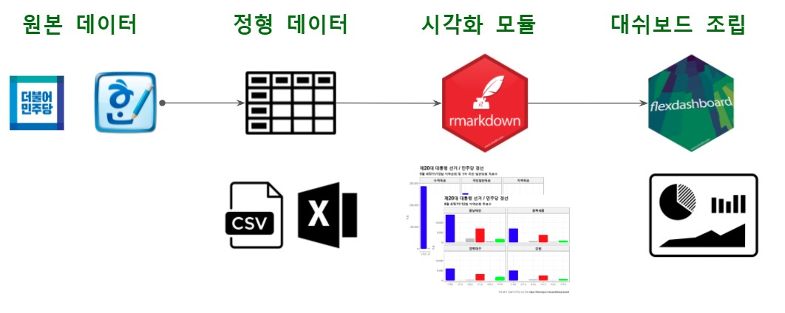

```{r setup, include=FALSE}
knitr::opts_chunk$set(echo = TRUE, message=FALSE, warning=FALSE,
                      comment="", digits = 3, tidy = FALSE, prompt = FALSE, fig.align = 'center')

```



# 민주당 경선 데이터 {#minju-race}

[민주당 보도자료](https://theminjoo.kr/board/lists/presskit)를 통해서 제 20 대 대선 후보자 선출을 위한 민주당 경선 데이터를 얻을 수 있다.

# 정형데이터 {.tabset}

```{r minju-module-data}
library(tidyverse)

library(tidyverse)
library(readxl)
library(testthat)

race_raw <- read_excel("data/2021_민주당 경선결과.xlsx", sheet = "Sheet1", skip =1)

race_tbl <- race_raw %>% 
  janitor::clean_names(ascii = FALSE) %>% 
  filter(!str_detect(x1, pattern = "^\\(")) %>% 
  select(!contains("합계"))

type_01 <- race_tbl %>% 
  select(시도 = x1, 이재명_3, 이낙연_4, 박용진_5, 추미애_6) %>% 
  filter(!str_detect(시도, "누적")) %>% 
  drop_na()

type_02 <- race_tbl %>% 
  select(시도 = x1, 이재명_8, 이낙연_9, 박용진_10, 추미애_11) %>% 
  filter(!str_detect(시도, "누적")) %>% 
  drop_na()

type_03 <- race_tbl %>% 
  select(시도 = x1, 이재명_13, 이낙연_14, 박용진_15, 추미애_16) %>% 
  filter(!str_detect(시도, "누적")) %>% 
  drop_na()

type_04 <- race_tbl %>% 
  select(시도 = x1, 이재명_18, 이낙연_19, 박용진_20, 추미애_21) %>% 
  filter(!str_detect(시도, "누적")) %>% 
  drop_na()

electoral_college <- race_tbl %>% 
  select(시도 = x1, 선거인단) %>% 
  filter(!str_detect(시도, "누적")) %>% 
  drop_na()

## 데이터 정규화

type_01_tbl <- type_01 %>% 
  pivot_longer(-시도, names_to = "후보자명", values_to = "득표") %>% 
  mutate(후보자명 = str_remove(후보자명, pattern = "_[0-9]+$")) %>% 
  mutate(구분 = "권리당원")

type_02_tbl <- type_02 %>% 
  pivot_longer(-시도, names_to = "후보자명", values_to = "득표") %>% 
  mutate(후보자명 = str_remove(후보자명, pattern = "_[0-9]+$")) %>% 
  mutate(구분 = "대의원")

type_03_tbl <- type_03 %>% 
  pivot_longer(-시도, names_to = "후보자명", values_to = "득표") %>% 
  mutate(후보자명 = str_remove(후보자명, pattern = "_[0-9]+$")) %>% 
  mutate(구분 = "유선전화")

type_04_tbl <- type_04 %>% 
  pivot_longer(-시도, names_to = "후보자명", values_to = "득표") %>% 
  mutate(후보자명 = str_remove(후보자명, pattern = "_[0-9]+$")) %>% 
  mutate(구분 = "국민선거인단")

race_tbl <- bind_rows(type_01_tbl, type_02_tbl) %>% 
  bind_rows(type_03_tbl) %>% 
  bind_rows(type_04_tbl) %>% 
  mutate(득표 = as.numeric(득표)) %>% 
  mutate(후보자명 = factor(후보자명, levels = c("이재명", "이낙연", "박용진", "추미애"))) %>% 
  mutate(시도 = factor(시도, levels = c("대전충남", "세종충북", "대구경북", "강원", "1차 슈퍼데이", "광주전남", "전북", "제주", "부울경", "인천", "2차 슈퍼데이"))) %>% 
  mutate(당원여론 = ifelse(str_detect(시도, "슈퍼데이"), "국민선거인단", "당원"))


## 데이터 내보내기 -----------------------------------------

race_tbl %>% 
  write_rds(file = "data/race_tbl.rds")

electoral_college %>% 
  write_rds(file = "data/electoral_college.rds")
## 엑셀 데이터 정합성 확인 ---------------------------------

test_that("엑셀 데이터 정합성", {

  total_sum <- race_tbl %>% 
    summarise(합계 = sum(득표)) %>% 
    pull()

  expect_equal(total_sum, 993656  )
})


sido_fct <- c("대전충남", "세종충북", "대구경북", "강원", "광주전남", "전북", "제주", "부울경", "인천")
report_day <- "10월 4일"
file_date <- "20211004"
```


## 선거인단

```{r electoral_college-raw-data}
library(reactable)

electoral_college %>% 
  reactable::reactable(
    filterable = FALSE,  defaultPageSize = 11,
    columns = list(
      선거인단 = colDef(format = colFormat(separators = TRUE, digits = 0))
    ),
    bordered = TRUE,
    highlight = TRUE
  )
```


## 득표

```{r vote-raw-data}
race_tbl %>% 
  pivot_wider(names_from = 후보자명, values_from = 득표) %>% 
  reactable::reactable(
    filterable = TRUE,  defaultPageSize = 9,
    columns = list(
      이재명 = colDef(format = colFormat(separators = TRUE, digits = 0)),
      이낙연 = colDef(format = colFormat(separators = TRUE, digits = 0)),
      박용진 = colDef(format = colFormat(separators = TRUE, digits = 0)),
      추미애 = colDef(format = colFormat(separators = TRUE, digits = 0))
    ),
    bordered = TRUE,
    highlight = TRUE
  )
```


# 모듈 {#module}

## `gt` 표 {.tabset}

### 선거인단 {#gt-table-electoral}

```{r electoral_college}
library(gt)

electoral_college %>% 
  mutate(비율 = 선거인단 / sum(선거인단)) %>% 
  gt::gt(
    rowname_col = "시도"
    ) %>% 
      tab_header(
      title = md("**&#9755; 제20대 대통령 선거 &#9754;**"),
      subtitle = md("*민주당 경선: 선거인단*")
    ) %>% 
    tab_source_note(
      source_note = md("기준 시점: 2021년 10월 04일")
    ) %>% 
    tab_options(
      table.width = pct(50),
      heading.background.color = "#1E61B0", # R logo 파란색
      heading.title.font.size = "32px",
      column_labels.background.color = "#F7F7F7", # R logo 회색 
      column_labels.font.weight = "bold",
      stub.background.color = "#ffffff",
      stub.font.weight = "bold"
    ) %>% 
    cols_align(
      align = "center",
      columns = c(시도)
    ) %>% 
    fmt_number(
      columns = 선거인단,
      decimals = 0
    ) %>% 
    fmt_percent(
      columns = 비율,
      decimals = 1
    ) %>% 
    tab_style(
      style = list(
        cell_fill(color = "#4083ef"),
        cell_text(weight = "bold")
      ),
      locations = cells_body(columns = c(시도, 선거인단, 비율), 
                             rows = str_detect(시도, "슈퍼"))) %>% 
    grand_summary_rows(
      columns = c(선거인단),
      fns = list(
        합계 = ~sum(.)),
      formatter = fmt_number,
      use_seps = TRUE,
      decimals = 0
    ) %>% 
    grand_summary_rows(
      columns = c(비율),
      fns = list(
        합계 = ~sum(.)),
      formatter = fmt_percent,
      use_seps = TRUE,
      decimals = 1
    ) %>% 
    cols_width(
      시도 ~ px(90),
      선거인단 ~ px(100),
      비율 ~ px(100)
    )

```


### 누적 득표 {#gt-table-sido}

```{r gt-votes}
race_tbl %>% 
  group_by(후보자명) %>%
  summarise(득표 = sum(득표)) %>% 
  ungroup() %>% 
  mutate(비율 = 득표 / sum(득표)) %>% 
  gt(rowname_col = "후보자명") %>% 
    tab_header(
      title = md("**&#9755; 제20대 대통령 선거 &#9754;**"),
      subtitle = md("*민주당 경선: 누적 득표수*")
    ) %>% 
    tab_source_note(
      source_note = md("기준 시점: 2021년 10월 04일")
    ) %>% 
    tab_options(
      table.width = pct(50),
      heading.background.color = "#1E61B0", # R logo 파란색
      heading.title.font.size = "32px",
      column_labels.background.color = "#F7F7F7", # R logo 회색 
      column_labels.font.weight = "bold",
      stub.background.color = "#ffffff",
      stub.font.weight = "bold"
    ) %>% 
    fmt_percent(
      columns = 비율,
      decimals = 1
    ) %>% 
    fmt_number(
      columns = 득표,
      decimals = 0
    ) %>% 
    grand_summary_rows(
      
      columns = c(득표),
      fns = list(
        합계 = ~sum(.)),
      formatter = fmt_number,
      use_seps = TRUE,
      decimals = 0
    ) %>% 
    grand_summary_rows(
      columns = c(비율),
      fns = list(
        합계 = ~sum(.)),
      formatter = fmt_percent,
      use_seps = TRUE,
      decimals = 1
    )  %>% 
    tab_style(
      style = list(
        cell_text(align = "center")
      ),
    locations = cells_stub(rows = TRUE)
  )
```


### 당원 vs 국민선거인단 {#gt-table-sido-member-opinion}

```{r gt-votes-member-opinion}
library(janitor)

## janitor 득표와 득표율에 큰 숫자에 천단위 콤마 추가
add_comma_seprator <- function(x) {
  first_half  <- str_extract(x, pattern = "^(.+?)\\(") %>% parse_number %>% scales::comma()
  second_half <- str_extract(x, pattern = "\\((.*?)\\)")
  glue::glue("{first_half}\n{second_half}")
}

race_tbl %>% 
  group_by(당원여론, 후보자명) %>%
  summarise(득표 = sum(득표)) %>% 
  ungroup() %>% 
  pivot_wider(names_from = 후보자명, values_from = 득표) %>% 
  ## janitor table decoration -----------
  adorn_totals(where = c("row", "col"), name = "합계") %>% 
  # mutate_if(is.numeric, scales::comma) %>% 
  adorn_percentages(denominator = "all") %>% 
  adorn_pct_formatting(digits = 1) %>% 
  adorn_ns(position = "front") %>% 
  mutate_at(vars(이재명, 이낙연, 박용진, 추미애, 합계), .funs =  add_comma_seprator) %>% 

  gt(rowname_col = "당원여론") %>% 
    tab_header(
      title = md("**&#9755; 제20대 대통령 선거 &#9754;**"),
      subtitle = md("*민주당 경선: 당원/여론 누적 득표수*")
    ) %>% 
    tab_source_note(
      source_note = md("기준 시점: 2021년 10월 04일")
    ) %>% 
    tab_options(
      table.width = pct(100),
      heading.background.color = "#1E61B0", # R logo 파란색
      heading.title.font.size = "32px",
      column_labels.background.color = "#F7F7F7", # R logo 회색 
      column_labels.font.weight = "bold",
      stub.background.color = "#ffffff",
      stub.font.weight = "bold"
    ) %>% 
    # fmt_number(
    #   columns = c(이재명, 이낙연, 박용진, 추미애, 합계),
    #   decimals = 0
    # ) %>% 
    tab_style(
      style = list(
        cell_text(align = "center")
      ),
    locations = cells_stub(rows = TRUE)
    ) %>% 
    tab_style(
      style = list(
        cell_fill(color = "#3c8ae8"),
        cell_text(
          align = "center",
          size = "medium",
          weight = "bold")
        ),
    locations = cells_body(rows = "합계")) %>% 
    tab_style(
      style = list(
        cell_fill(color = "#3c8ae8"),
        cell_text(
          align = "center",
          size = "medium",
          weight = "bold")
        ),
    locations = cells_body(columns = "합계"))
```

### 지역별 당원 {#gt-table-sido-member}

```{r gt-votes-member-sido2}
race_tbl %>% 
  filter(!str_detect(시도, "슈퍼")) %>% 
  group_by(시도, 후보자명) %>%
  summarise(득표 = sum(득표)) %>% 
  ungroup() %>% 
  pivot_wider(names_from = 후보자명, values_from = 득표) %>% 
  ## janitor table decoration -----------
  adorn_totals(where = c("row", "col"), name = "합계") %>% 
  # mutate_if(is.numeric, scales::comma) %>% 
  adorn_percentages(denominator = "all") %>% 
  adorn_pct_formatting(digits = 1) %>% 
  adorn_ns(position = "front") %>% 
  mutate_at(vars(이재명, 이낙연, 박용진, 추미애, 합계), .funs =  add_comma_seprator)  %>%  
  gt(rowname_col = "시도") %>% 
    tab_header(
      title = md("**&#9755; 제20대 대통령 선거 &#9754;**"),
      subtitle = md("*민주당 경선: 시도별 누적 득표수*")
    ) %>% 
    tab_source_note(
      source_note = md("기준 시점: 2021년 10월 04일")
    ) %>% 
    tab_options(
      table.width = pct(80),
      heading.background.color = "#1E61B0", # R logo 파란색
      heading.title.font.size = "32px",
      column_labels.background.color = "#F7F7F7", # R logo 회색 
      column_labels.font.weight = "bold",
      stub.background.color = "#ffffff",
      stub.font.weight = "bold"
    ) %>% 
    # fmt_number(
    #   columns = c(이재명, 이낙연, 박용진, 추미애),
    #   decimals = 0
    # ) %>% 
    # grand_summary_rows(
    #   columns = c(이재명, 이낙연, 박용진, 추미애),
    #   fns = list(
    #     합계 = ~sum(.)),
    #   formatter = fmt_number,
    #   use_seps = TRUE,
    #   decimals = 0
    # ) %>% 
    tab_style(
      style = list(
        cell_text(align = "center")
      ),
    locations = cells_stub(rows = TRUE)
    ) %>% 
    tab_style(
      style = list(
        cell_fill(color = "#3c8ae8"),
        cell_text(
          align = "center",
          size = "medium",
          weight = "bold")
        ),
    locations = cells_body(rows = "합계")) %>% 
    tab_style(
      style = list(
        cell_fill(color = "#3c8ae8"),
        cell_text(
          align = "center",
          size = "medium",
          weight = "bold")
        ),
    locations = cells_body(columns = "합계"))

```

### 국민선거인단 {#gt-table-sido-member-people}

```{r gt-votes-member}
race_tbl %>% 
  filter(str_detect(시도, "슈퍼")) %>% 
  group_by(시도, 후보자명) %>%
  summarise(득표 = sum(득표)) %>% 
  ungroup() %>% 
  pivot_wider(names_from = 후보자명, values_from = 득표) %>%
  ## janitor table decoration -----------
  adorn_totals(where = c("row", "col"), name = "합계") %>% 
  # mutate_if(is.numeric, scales::comma) %>% 
  adorn_percentages(denominator = "all") %>% 
  adorn_pct_formatting(digits = 1) %>% 
  adorn_ns(position = "front") %>% 
  mutate_at(vars(이재명, 이낙연, 박용진, 추미애, 합계), .funs =  add_comma_seprator)  %>%  
  
  gt(rowname_col = "시도") %>% 
    tab_header(
      title = md("**&#9755; 제20대 대통령 선거 &#9754;**"),
      subtitle = md("*민주당 경선: 국민선거인단 누적 득표수*")
    ) %>% 
    tab_source_note(
      source_note = md("기준 시점: 2021년 10월 04일")
    ) %>% 
    tab_options(
      table.width = pct(100),
      heading.background.color = "#1E61B0", # R logo 파란색
      heading.title.font.size = "32px",
      column_labels.background.color = "#F7F7F7", # R logo 회색 
      column_labels.font.weight = "bold",
      stub.background.color = "#ffffff",
      stub.font.weight = "bold"
    ) %>% 
    # fmt_number(
    #   columns = c(이재명, 이낙연, 박용진, 추미애),
    #   decimals = 0
    # ) %>% 
    # grand_summary_rows(
    #   columns = c(이재명, 이낙연, 박용진, 추미애),
    #   fns = list(
    #     합계 = ~sum(.)),
    #   formatter = fmt_number,
    #   use_seps = TRUE,
    #   decimals = 0
    # ) %>% 
    tab_style(
      style = list(
        cell_text(align = "center")
      ),
    locations = cells_stub(rows = TRUE)
    ) %>% 
    tab_style(
      style = list(
        cell_fill(color = "#3c8ae8"),
        cell_text(
          align = "center",
          size = "medium",
          weight = "bold")
        ),
    locations = cells_body(rows = "합계")) %>% 
    tab_style(
      style = list(
        cell_fill(color = "#3c8ae8"),
        cell_text(
          align = "center",
          size = "medium",
          weight = "bold")
        ),
    locations = cells_body(columns = "합계"))  
```

## `ggplot` 그래프 {.tabset}

### 선거인단 {#ggplot-electoral-college}

```{r ggplot-electoral-colledge}
library(patchwork)

# 선거인단 ----------------
votes_tbl <- race_tbl %>% 
  group_by(시도) %>% 
  summarise(총투표수 = sum(득표))

electoral_g <- electoral_college %>% 
  left_join(votes_tbl) %>% 
  pivot_longer(-시도) %>%  
  mutate(시도 = factor(시도, levels = c("대전충남", "세종충북", "대구경북", "강원", "1차 슈퍼데이", "광주전남", "전북", "제주", "부울경", "인천", "2차 슈퍼데이"))) %>% 
  ggplot(aes(x = 시도, y = value, fill = name, width = ifelse(name == "총투표수", 0.3, 0.5))) +
    geom_col(stat = "identity") +
    theme_bw(base_family = "NanumGothic") +
    theme(legend.position = "right",
          axis.text.y = element_text(size = rel(1.5), colour = "gray35", family = "NanumBarunpen", face="bold"),
          axis.text.x = element_text(size = rel(1.0), colour = "black", family = "NanumBarunpen", face="bold",
                                     angle = 15, vjust = 0.5, hjust=0.5),
          strip.background=element_rect(fill="gray95"),
          plot.title=element_text(size=18, face="bold", family = "NanumBarunpen"),
          plot.subtitle=element_text(face="bold", size=13, colour="grey10", family = "NanumBarunpen")) +
    labs(x        = "",
         y        = "",
         title    = "제20대 대통령 선거 / 민주당 경선",
         subtitle = glue::glue("{report_day} 기준 선거인단과 총투표수"),
         caption  = "자료 출처: 더불어 민주당 보도자료, https://theminjoo.kr/board/lists/presskit",
         fill     = "") +
    scale_y_continuous(labels = scales::comma) +
    # coord_flip() +
    scale_fill_manual(values = c("gray77", "darkblue"))

electoral_g
```

### 누적 득표수 {#ggplot-cumsum-votes}

```{r ggplot-cumsum-votes}

## 누적 ----------
race_sum_tbl <- race_tbl %>% 
  group_by(후보자명) %>% 
  summarise(누적득표 = sum(득표)) %>% 
  arrange(-누적득표)

cumsum_g <- race_sum_tbl %>% 
  mutate(후보자명 = factor(후보자명, levels = c("이재명", "이낙연", "박용진", "추미애"))) %>% 
  ggplot(aes(x = 후보자명, y = 누적득표, fill = 후보자명)) +
    geom_col(width = 0.3) +
    theme_bw(base_family = "NanumGothic") +
    theme(legend.position = "none",
          axis.text.y = element_text(size = rel(1.5), colour = "gray35", family = "NanumBarunpen", face="bold"),
          axis.text.x = element_text(size = rel(2.0), colour = "black", family = "NanumBarunpen", face="bold"),
          strip.background=element_rect(fill="gray95"),
          plot.title=element_text(size=18, face="bold", family = "NanumBarunpen"),
          plot.subtitle=element_text(face="bold", size=13, colour="grey10", family = "NanumBarunpen")) +
    labs(x = "",
         y = "",
         title = "제20대 대통령 선거 / 민주당 경선",
         subtitle = glue::glue("{report_day} 기준 누적 득표수"),
         caption = "자료 출처: 더불어 민주당 보도자료, https://theminjoo.kr/board/lists/presskit") +
    scale_y_continuous(labels = scales::comma) +
    scale_fill_manual(values = c("blue", "red", "gray", "green"))

cumsum_g
# # 총괄 요약 ------------------------------------------
# extrafont::loadfonts()
# 
# (cumsum_g +
#     labs(title = "",
#          subtitle = "누적 득표수",
#          caption = "")) +
# (electoral_g +
#   labs(title = "",
#        subtitle = "선거인단과 총투표수",
#        caption = "") ) +
#   plot_annotation(title = '제20대 대통령 선거 / 민주당 경선') &
#   theme_bw(base_family = "NanumBarunpen") +
#   theme(legend.position = "none",
#           axis.text.x = element_text(angle = 90, vjust = 0.5, hjust=1))
```

### 당원 국민선거인단 {#ggplot-cumsum-votes-sido-people-2}

```{r ggplot-cumsum-votes-sido-people-2}

cumsum_two_g <- race_tbl %>% 
  group_by(당원여론, 후보자명) %>% 
  summarise(득표 = sum(득표)) %>% 
  ungroup() %>% 
  pivot_wider(names_from = 당원여론, values_from = 득표) %>% 
  mutate(누적득표 = 국민선거인단  + 당원) %>% 
  pivot_longer(국민선거인단:누적득표, names_to = "구분", values_to = "득표") %>% 
  mutate(후보자명 = factor(후보자명, levels = c("이재명", "김두관", "정세균", "이낙연", "박용진", "추미애")),
         구분     = factor(구분, levels = c("누적득표", "국민선거인단", "당원"))) %>% 
  ggplot(aes(x = 후보자명, y = 득표, fill = 후보자명)) +
    geom_col(width = 0.5) +
    facet_wrap(~구분) +
    theme_bw(base_family = "NanumGothic") +
    theme(legend.position = "none",
          strip.text.x = element_text(size = rel(1.7), colour = "black", family = "NanumMyeongjo", face="bold"),
          axis.text.y = element_text(size = rel(1.5), colour = "gray35", family = "NanumBarunpen", face="bold"),
          axis.text.x = element_text(size = rel(1.3), colour = "black", family = "NanumBarunpen", face="bold"),
          strip.background=element_rect(fill="gray95"),
          plot.title=element_text(size=18, face="bold", family = "NanumBarunpen"),
          plot.subtitle=element_text(face="bold", size=13, colour="grey10", family = "NanumBarunpen")) +
    labs(x = "",
         y = "",
         title = "제20대 대통령 선거 / 민주당 경선",
         subtitle = "국민선거인단, 당원 누적 득표수") +
    scale_y_continuous(labels = scales::comma) +
    scale_fill_manual(values = c("blue", "red", "gray", "green"))  

cumsum_two_g
```


### 지역별 득표수 {#ggplot-cumsum-votes-sido}

```{r ggplot-cumsum-votes-sido}

## 누적 ----------
sido_g <- race_tbl %>% 
  filter(!str_detect(시도, "슈퍼")) %>% 
  ggplot(aes(x = 후보자명, y = 득표, fill = 후보자명)) +
    geom_col() +
    facet_wrap(~시도) +
    theme_bw(base_family = "NanumGothic") +
    theme(legend.position = "none",
          strip.text.x = element_text(size = rel(1.1), colour = "black", family = "NanumMyeongjo", face="bold"),
          axis.text.y = element_text(size = rel(1.5), colour = "gray35", family = "NanumBarunpen", face="bold"),
          axis.text.x = element_text(size = rel(1.3), colour = "black", family = "NanumBarunpen", face="bold"),
          strip.background=element_rect(fill="gray95"),
          plot.title=element_text(size=18, face="bold", family = "NanumBarunpen"),
          plot.subtitle=element_text(face="bold", size=13, colour="grey10", family = "NanumBarunpen")) +
    labs(x = "",
         y = "",
         title = "제20대 대통령 선거 / 민주당 경선",
         subtitle = "지역순회 시도별 득표수") +
    scale_y_continuous(labels = scales::comma) +
    scale_fill_manual(values = c("blue", "gray", "gray", "red", "gray", "green"))

sido_g
```

### 국민선거인단 {#ggplot-cumsum-votes-sido-people}

```{r ggplot-cumsum-votes-sido-people}

## 누적 ----------
people_g <- race_tbl %>% 
  filter(str_detect(시도, "슈퍼")) %>% 
  ggplot(aes(x = 후보자명, y = 득표, fill = 후보자명)) +
    geom_col(width = 0.5) +
    facet_wrap(~시도) +
    theme_bw(base_family = "NanumGothic") +
    theme(legend.position = "none",
          strip.text.x = element_text(size = rel(1.7), colour = "black", family = "NanumMyeongjo", face="bold"),
          axis.text.y = element_text(size = rel(1.5), colour = "gray35", family = "NanumBarunpen", face="bold"),
          axis.text.x = element_text(size = rel(1.3), colour = "black", family = "NanumBarunpen", face="bold"),
          strip.background=element_rect(fill="gray95"),
          plot.title=element_text(size=18, face="bold", family = "NanumBarunpen"),
          plot.subtitle=element_text(face="bold", size=13, colour="grey10", family = "NanumBarunpen")) +
    labs(x = "",
         y = "",
         title = "제20대 대통령 선거 / 민주당 경선",
         subtitle = "국민선거인단 득표수") +
    scale_y_continuous(labels = scales::comma) +
    scale_fill_manual(values = c("blue", "red", "gray", "green"))

people_g
```


