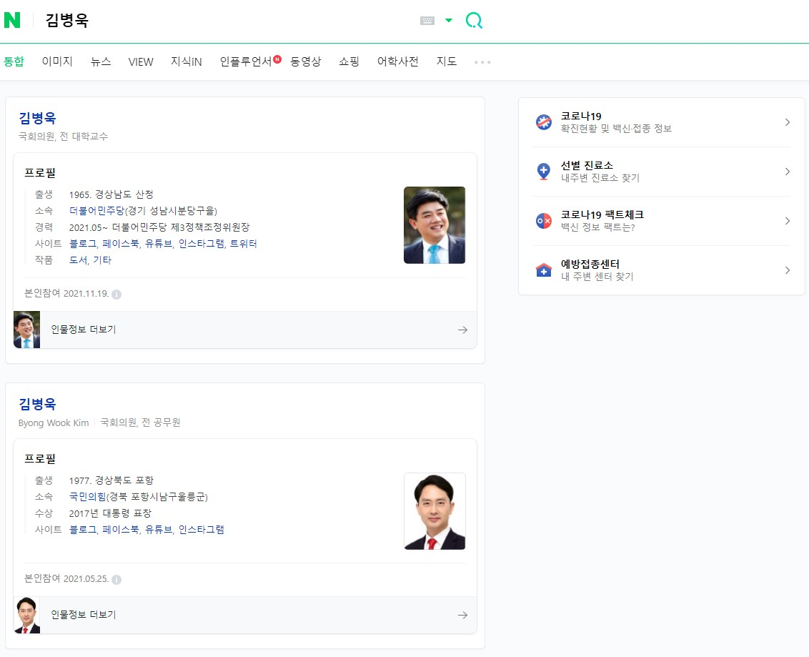

```{r setup, include=FALSE}
knitr::opts_chunk$set(echo = TRUE, message=FALSE, warning=FALSE,
                      comment="", digits = 3, tidy = FALSE, prompt = FALSE, fig.align = 'center')
library(tidyverse)
library(rvest)
library(lubridate)
```

# 데이터 [^previous-crawling] {#congressman-data}

[^previous-crawling]: [데이터 가져오기 - 네이버 인물정보](https://statkclee.github.io/ingest-data/naver-people-info.html)

[제21대 국회의원 - 마스터](https://statkclee.github.io/president/president-congressman-master.html)에서 현재 시점(2021년 11월 22일) 기준 제21대 국회의원 마스터를 작성한다.

```{r get-congressman-master}
library(reactable)
library(tidyverse)
library(rvest)

congressman_tbl <- 
  read_rds("data/congressman/congressman_21_master.rds") %>% 
  arrange(의원명)

congressman_tbl %>% 
  select(-id, -대수, -지역, -선수, - 당선방법) %>% 
  arrange(desc(시도명)) %>% 
  reactable::reactable(
      defaultColDef = colDef(
        header = function(value) gsub(".", " ", value, fixed = TRUE),
        cell = function(value) format(value, nsmall = 1),
        align = "center",
        minWidth = 30,
        headerStyle = list(background = "#f7f7f8")
      ),
      columns = list(
        소속위원회 = colDef(minWidth = 50),
        지역구명 = colDef(minWidth = 100)
      ),
      bordered = TRUE,
      highlight = TRUE
)
```


# 네이버 인물정보 {#naver-info}

## 분당을 김병욱 의원 {#naver-info-bundang}

```{r naver-info-one}
# 1. 데이터: 네이버 인물정보 -----

## 1.1. 네이버 주소 -----

people_name <- "김병욱"

naver_url <- glue::glue("https://search.naver.com/search.naver?where=nexearch&sm=top_hty&fbm=1&ie=utf8&query={people_name}")

## 1.2. 네이버 인물정보 긁어오기 -----
### 사진정보 
pic_info <- read_html(naver_url) %>% 
  html_node(xpath = '//*[@id="main_pack"]/section[1]/div[1]/div[2]') %>% 
  html_node(css = 'img') %>% 
  html_attr('src')
  
pic_info_df <- tibble(key="사진", value=pic_info)

### 인물정보 ---------------------------------
key <- read_html(naver_url) %>% 
        html_node(xpath = '//*[@id="main_pack"]/section[1]/div[1]/div[2]') %>% 
        html_nodes('dt') %>% 
        html_text() %>% 
        as_tibble() %>% 
        rename(key=value)

value <- read_html(naver_url) %>% 
  html_node(xpath = '//*[@id="main_pack"]/section[1]/div[1]/div[2]') %>% 
  html_nodes('dd') %>% 
  html_text()

### SNS 서비스 ------------------------
info_nodes <- read_html(naver_url) %>% 
  html_node(xpath = '//*[@id="main_pack"]/section[1]/div[1]/div[2]') %>% 
  html_node(css = "dl")

#### SNS 서비스 이름
sns_name <- html_children(info_nodes) %>% 
  .[[4]] %>% 
  html_nodes("a") %>% 
  html_text()

#### SNS URL Links
sns_url <- html_children(info_nodes) %>% 
  .[[4]] %>% 
  html_nodes("a") %>% 
  html_attr("href")

sns_raw <- tibble(SNS = sns_name, 
                  link = sns_url)

sns_tbl <- sns_raw %>% 
  nest(SNS = everything())

### 데이터프레임 변환 -------------------------
p_info_tbl <- bind_cols(key=key, value=value) %>% 
  bind_rows(pic_info_df) %>% 
  pivot_wider(names_from = key, values_from = value) %>% 
  mutate(sns = sns_tbl)

reactable(p_info_tbl)
```


## 인물정보 함수 {#naver-info-bundang-funciton}

```{r naver-info-function}

people_info <- function(people_name = "김병욱") {
  
  cat("----------------", people_name, "\n")

  ## 1.1. 네이버 주소 -----

  naver_url <- glue::glue("https://search.naver.com/search.naver?where=nexearch&sm=top_hty&fbm=1&ie=utf8&query={people_name}")
  
  ## 1.2. 네이버 인물정보 긁어오기 -----
  ### 사진정보 
  pic_info <- read_html(naver_url) %>% 
    html_node(css = ".cm_info_box") %>% 
    html_node(css = 'img') %>% 
    html_attr('src')
    
  pic_info_df <- tibble(key="사진", value=pic_info)
  
  ### 인물정보 ---------------------------------
  key <- read_html(naver_url) %>% 
    html_node(css = ".cm_info_box") %>% 
    html_nodes("dt") %>% 
    html_text()
  
  tmp_value <- read_html(naver_url) %>% 
    html_node(css = "div.cm_info_box > div.detail_info") %>% 
    html_nodes('div.info_group') %>% 
    html_text()
  
  value <- str_remove(str_trim(tmp_value), key) %>% 
    str_trim(.)
  
  ### SNS 서비스 ------------------------
  #### 전체 링크와 전체 링크명
  all_link <- read_html(naver_url) %>% 
      html_node(css = ".cm_info_box") %>% 
      html_nodes('dd') %>% 
      html_nodes("a") %>% 
      html_attr("href")
  
  all_link_name <- read_html(naver_url) %>% 
    html_node(css = ".cm_info_box") %>% 
    html_nodes('dd') %>% 
    html_nodes("a") %>% 
    html_text()
  
  #### SNS 마스크
  SNS_mask <- str_detect(all_link, pattern = "^http")
  
  SNS_link <- all_link[SNS_mask]
  SNS_name <- all_link_name[SNS_mask]
  
  #### SNS 데이터프레임
  
  sns_raw <- tibble(SNS = SNS_name, 
                    link = SNS_link)
  
  sns_tbl <- sns_raw %>% 
    nest(SNS = everything())

  ### 데이터프레임 변환 -------------------------
  p_info_tbl <- bind_cols(key=key, value=value) %>% 
    bind_rows(pic_info_df) %>% 
    pivot_wider(names_from = key, values_from = value) %>% 
    mutate(sns = sns_tbl)
  
  return(p_info_tbl)
}

people_info("송영길")
```

## 전체 국회의원 {#all-congressman}

중복된 국회의원을 확인한다.

```{r all-congressman-stat}
congressman_tbl %>% 
  count(의원명, sort = TRUE) %>% 
  filter(n !=1)
```

전체 국회의원을 초벌로 쭉 돌려 국회의원 인물정보 데이터를 추출한다.

```{r all-congressman, eval = FALSE}

congressman_tbl %>% 
  count(의원명, sort = TRUE) %>% 
  filter(n !=1)

people_info_possibly <- possibly(.f = people_info, otherwise = "Error")

congressman_info_raw_list <- map(congressman_tbl$의원명, people_info_possibly)

congressman_info_raw_list %>% 
  write_rds("data/congressman_info_raw_list.rds")

congressman_info_raw_tbl <- map_df(congressman_info_raw_list, rbind) %>% 
  mutate(의원명 = congressman$의원명) %>% 
  select(의원명, everything())

congressman_info_raw_tbl %>% 
  write_rds("data/congressman_info_raw_tbl.rds")

```

## 중복 국회의원 {#all-congressman-dedup}

김병욱, 이수진 두명이 동명이인이기 때문에 이를 크롤링 함수를 일부 수정하여 반영한다.
김병욱 의원은 당이 다른데 이수진 의원은 정당도 동일한데 한분은 지역구, 한분은 비례의원이다.



```{r dedup-congressman, eval = FALSE}
congressman_info_raw_tbl %>% 
  # filter(의원명 %in% c("김병욱", "이수진"))
  filter(의원명 %in% c("이수진"))

second_person_info <- function(people_name = "이수진") {

  ## 1.1. 네이버 주소 -----
  
  naver_url <- glue::glue("https://search.naver.com/search.naver?where=nexearch&sm=top_hty&fbm=1&ie=utf8&query={people_name}")
  
  ## 1.2. 네이버 인물정보 긁어오기 -----
  ### 사진정보 
  pic_info <- read_html(naver_url) %>% 
    html_nodes(css = ".cm_info_box") %>% 
    .[[2]] %>% 
    html_node(css = 'img') %>% 
    html_attr('src')
    
  pic_info_df <- tibble(key="사진", value=pic_info)
  
  ### 인물정보 ---------------------------------
  key <- read_html(naver_url) %>% 
    html_nodes(css = ".cm_info_box") %>% 
    .[[2]] %>% 
    html_nodes("dt") %>% 
    html_text()
  
  tmp_value <- read_html(naver_url) %>% 
    html_nodes(css = "div.cm_info_box > div.detail_info") %>% 
    .[[2]] %>% 
    html_nodes('div.info_group') %>% 
    html_text()
  
  value <- str_remove(str_trim(tmp_value), key) %>% 
    str_trim(.)
  
  ### SNS 서비스 ------------------------
  #### 전체 링크와 전체 링크명
  all_link <- read_html(naver_url) %>% 
    html_nodes(css = ".cm_info_box") %>% 
    .[[2]] %>% 
      html_nodes('dd') %>% 
      html_nodes("a") %>% 
      html_attr("href")
  
  all_link_name <- read_html(naver_url) %>% 
    html_nodes(css = ".cm_info_box") %>% 
    .[[2]] %>% 
    html_nodes('dd') %>% 
    html_nodes("a") %>% 
    html_text()
  
  #### SNS 마스크
  SNS_mask <- str_detect(all_link, pattern = "^http")
  
  SNS_link <- all_link[SNS_mask]
  SNS_name <- all_link_name[SNS_mask]
  
  #### SNS 데이터프레임
  
  sns_raw <- tibble(SNS = SNS_name, 
                    link = SNS_link)
  
  sns_tbl <- sns_raw %>% 
    nest(SNS = everything())
  
  ### 데이터프레임 변환 -------------------------
  p_info_tbl <- bind_cols(key=key, value=value) %>% 
    bind_rows(pic_info_df) %>% 
    pivot_wider(names_from = key, values_from = value) %>% 
    mutate(sns = sns_tbl)
  
  return(p_info_tbl)
}

lsj_tbl <- people_info("이수진") %>% mutate(의원명 = "이수진")
lsj_second_tbl <- second_person_info("이수진") %>% mutate(의원명 = "이수진2")

kbu_tbl <- people_info("김병욱") %>% mutate(의원명 = "김병욱")
kbu_second_tbl <- second_person_info("김병욱") %>% mutate(의원명 = "김병욱")


```

## 최종 마무리 {#all-congressman-dedup-clear}


```{r dedup-congressman-clear, eval = FALSE}
congressman_info_tbl <- congressman_info_raw_tbl %>% 
  filter(! 의원명 %in% c("김병욱", "이수진")) %>% 
  bind_rows(lsj_tbl) %>% 
  bind_rows(lsj_second_tbl) %>% 
  bind_rows(kbu_tbl) %>% 
  bind_rows(kbu_second_tbl)

congressman_info_tbl

congressman_info_tbl %>% 
  write_rds("data/congressman/congressman_info_tbl.rds")
```

# EDA {#all-congressman-EDA}

```{r all-congressman-EDA}
congressman_info_raw <- 
  read_rds("data/congressman/congressman_info_tbl.rds")

congressman_tbl <- congressman_info_raw %>% 
  select(의원명, 소속, sns) %>% 
  mutate(SNS수 = map_int(sns$SNS, ~nrow(.x)))

congressman_tbl %>% 
  mutate(정당 = str_extract(소속, pattern = "[^(]*")) %>% 
  group_by(정당) %>% 
  summarise(평균SNS = mean(SNS수))
```

# SNS {#all-congressman-SNS}

## 데이터 정제 {#all-congressman-SNS-clean}

```{r sns-count-clean, eval = FALSE}
congressman_tbl <- 
  read_rds("data/congressman/congressman_info_tbl.rds")

congressman_id_tbl <- congressman_tbl %>% 
  select(의원명, 소속, sns) %>% 
  mutate(정당 = str_extract(소속, pattern = "[^(]*")) %>% 
  mutate(정당 = case_when(의원명 == "유정주" ~ "더불어민주당",
                           의원명 == "윤미향" ~ "무소속",
                           의원명 == "최승재" ~ "국민의힘",
                           의원명 == "강병원" ~ "더불어민주당",
                           의원명 == "권칠승" ~ "더불어민주당",
                           의원명 == "박병석" ~ "더불어민주당",
                           의원명 == "서동용" ~ "더불어민주당",
                           의원명 == "유기홍" ~ "더불어민주당",
                           의원명 == "정진석" ~ "국민의힘",
                           TRUE ~ 정당)) %>% 
  mutate(id = glue::glue("{의원명}_{정당}")) %>% 
  select(id, 의원명, 정당, sns)

congressman_sns_tbl <- congressman_id_tbl  %>% 
  mutate(SNS_ALL = map(sns$SNS, ~mutate(.x, new = glue::glue("{SNS}*{link}")))) %>% 
  mutate(SNS_name_link = map(SNS_ALL, ~select(.x, new))) %>% 
  group_by(id) %>% 
  unnest(SNS_name_link) %>% 
  select(의원명, new) %>% 
  separate(new, into = c("사이트", "링크"), sep = "\\*") %>% 
  ungroup() %>% 
  mutate(사이트 = ifelse(str_detect(사이트, "[배준영|우상호]TV"), "유튜브", 사이트)) %>% 
  mutate(사이트 = ifelse(str_detect(사이트, "카카오톡?채널"), "카카오톡채널", 사이트))  

# congressman_sns_tbl %>% 
#   filter(의원명 =="구자근")
#   filter(str_detect(사이트, "은메달|세바시|청년의"))

congressman_sns_tbl  %>% 
  write_rds("data/congressman/congressman_sns_tbl.rds")
```


## SNS 요약표 {#sns-summary-table}

```{r sns-summary-table}
library(gt)

congressman_sns_tbl  <- 
  read_rds("data/congressman/congressman_sns_tbl.rds")

SNS_stat_gt <- congressman_sns_tbl %>% 
  count(사이트, sort =TRUE, name = "의원수") %>% 
  mutate(비율 = 의원수 /295) %>% 
  gt() %>% 
  tab_header(
      title = md("**&#9755; 제20대 대통령 선거 &#9754;**"),
      subtitle = md("*제21대 국회의원 SNS 활용현황*")
    ) %>% 
    tab_source_note(
      source_note = md("기준 시점: 2021년 11월 22일")
    ) %>% 
    tab_options(
      table.width = pct(100),
      heading.background.color = "#1E61B0", # R logo 파란색
      heading.title.font.size = "32px",
      column_labels.background.color = "#F7F7F7", # R logo 회색 
      column_labels.font.weight = "bold",
      stub.background.color = "#ffffff",
      stub.font.weight = "bold"
    ) %>% 
    cols_align(
      align = "center",
      columns = c(사이트)
    ) %>% 
    fmt_number(
      columns = 의원수,
      decimals = 0
    ) %>% 
    fmt_percent(
      columns = 비율,
      decimals = 1
    ) 

SNS_stat_gt
```

