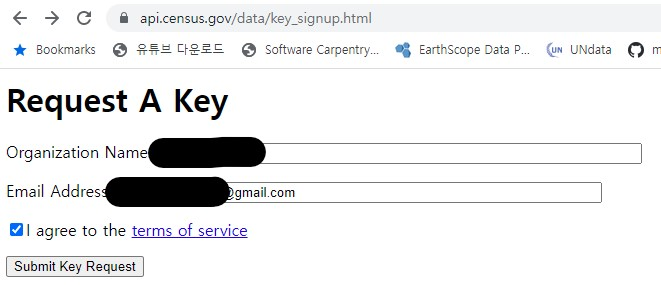
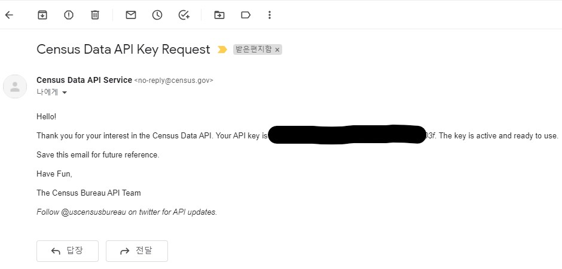

```{r setup, include=FALSE}
knitr::opts_chunk$set(echo = TRUE, message=FALSE, warning=FALSE,
                      comment="", digits = 3, tidy = FALSE, prompt = FALSE, fig.align = 'center')
library(tidyverse)
library(rvest)
library(lubridate)
```

# 데이터 {#demographic-data}

[`idbr`](https://cran.r-project.org/web/packages/idbr/index.html) 패키지는 "Use R to make requests to the US Census Bureau's International Data Base API"를 기반으로 하고 있다. API를 통한 인증방식을 통해 데이터를 열어주고 있기 때문에 미국 통계국 인증웹페이지 <http://api.census.gov/data/key_signup.html> 에서 전자우편을 통해 API키를 발급받는다.

|                          |                                |
|--------------------------|--------------------------------|
|  |  |

발급받은 API_KEY를 `usethis::edit_r_environ()` 명령어로 `.Renviron` 파일에 적어두고 불러 사용하여 외부에 노출되는 일이 없도록 한다.

```{r idbr, eval  = FALSE}
library(tidyverse)
library(idbr)

idb_api_key(Sys.getenv("IDBR_Key"))

male <- get_idb('KS', 1990:2050, sex = 'male') %>%
  mutate(SEX = 'Male')

female <- get_idb('KS', 1990:2050, sex = 'female') %>%
  mutate(POP = POP * -1,
         SEX = 'Female')

korea <- bind_rows(male, female) %>%
  mutate(abs_pop = abs(POP))

korea_demographic <- korea %>% 
  mutate(SEX = ifelse(SEX == "Male", "남자", "여자"))

korea_demographic %>% 
  write_rds("data/korea_demographic.rds")

```

# EDA {#demographic-data-EDA}

## 주요 대선과 세대별 유권자수 {#election-generation}

```{r data-EDA}
library(gt)
library(gtExtras)

demographic  <-  
  read_rds("data/korea_demographic.rds") %>% 
  filter(time <= 2021) %>% 
  filter(time %in% c(2012, 2017, 2021))

# demographic %>% 
#   group_by(SEX, time) %>% 
#   summarise(인구_데이터 = list(abs_pop), .groups = "drop") %>% 
#   gt() %>%
#   gt_sparkline(인구_데이터)

presid_2030_gt <- demographic %>% 
  janitor::clean_names(ascii = FALSE) %>% 
  mutate(age_group = case_when(age >= 0 & age  <=18 ~ "00-18",
                               age >= 19 & age <=39 ~ "20-30",
                               age >= 40 & age <=59 ~ "40-50",
                               TRUE ~ "60+")) %>% 
  group_by(time, age_group) %>% 
  summarise(인구수 = sum(abs_pop), .groups = "drop") %>% 
  group_by(time) %>% 
  mutate(비율 = 인구수 / sum(인구수)) %>% 
  mutate(비율 = scales::percent(비율, accuracy = 1),
         인구수 = scales::comma(인구수)) %>% 
  mutate(출력 = glue::glue("{인구수} <br> ({비율})")) %>% 
  ungroup() %>% 
  select(time, age_group, 출력) %>% 
  pivot_wider(names_from = age_group, values_from = 출력) %>% 
  gt() %>% 
  gt_theme_538() %>%
    tab_header(
      title = md("**&#x2600; 제20대 대통령 선거 &#x2600;**"),
      subtitle = md("*주요 대선 세대별 유권자수 (2030을 중심으로)*")
    ) %>%
    opt_align_table_header(align = "center") %>%
    tab_options(
      table.width = "600px",
      heading.background.color = "#1E61B0", # R logo 파란색
      heading.title.font.size = "20px",
      column_labels.background.color = "#F7F7F7", # R logo 회색
      column_labels.font.weight = "bold",
      stub.background.color = "#ffffff",
      stub.font.weight = "bold"
    ) %>% 
    gt_highlight_cols(columns = `20-30`, font_weight = "bold", fill  = "#ffffff") %>% 
    fmt_markdown(columns = `00-18`:`60+` ) 

presid_2030_gt %>% 
  gtsave("fig/presid_2030_gt.png")

# presid_2030_gt

```

## 세대별 주요 대선 유권자수 {#election-generation-vs}

```{r data-EDA-vs}

presid_2030_vs_gt <- demographic %>% 
  janitor::clean_names(ascii = FALSE) %>% 
  mutate(age_group = case_when(age >= 0 & age  <=18 ~ "00-18",
                               age >= 19 & age <=39 ~ "20-30",
                               age >= 40 & age <=59 ~ "40-50",
                               TRUE ~ "60+")) %>% 
  group_by(time, age_group) %>% 
  summarise(인구수 = sum(abs_pop), .groups = "drop") %>% 
  group_by(time) %>% 
  mutate(비율 = 인구수 / sum(인구수)) %>% 
  mutate(비율 = scales::percent(비율, accuracy = 1),
         인구수 = scales::comma(인구수)) %>% 
  mutate(출력 = glue::glue("{인구수} <br> ({비율})")) %>% 
  ungroup() %>% 
  select(time, age_group, 출력) %>% 
  pivot_wider(names_from = time, values_from = 출력) %>% 
  gt() %>% 
  gt_theme_538() %>%
    tab_header(
      title = md("**&#x2600; 제20대 대통령 선거 &#x2600;**"),
      subtitle = md("*주요 대선 세대별 유권자수 (2030을 중심으로)*")
    ) %>%
    opt_align_table_header(align = "center") %>%
    tab_options(
      table.width = "600px",
      heading.background.color = "#1E61B0", # R logo 파란색
      heading.title.font.size = "20px",
      column_labels.background.color = "#F7F7F7", # R logo 회색
      column_labels.font.weight = "bold",
      stub.background.color = "#ffffff",
      stub.font.weight = "bold"
    ) %>% 
    gt_highlight_rows(rows = age_group == "20-30", font_weight = "bold", fill  = "#ffffff") %>% 
    fmt_markdown(columns = `2012`:`2021` ) 

presid_2030_vs_gt %>% 
  gtsave("fig/presid_2030_vs_gt.png")

# presid_2030_vs_gt
```
