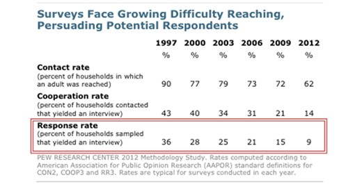

```{r setup, include=FALSE}
knitr::opts_chunk$set(echo = TRUE, message=FALSE, warning=FALSE,
                      comment="", digits = 3, tidy = FALSE, prompt = FALSE, fig.align = 'center')
```

# 여론조사 지지도 추정 {#estimate-support}

대선 후보에 대한 $여론조사결과_{ijkt}$는 $i$ 조사기관 효과(house effect), $j$ 의뢰기관(sponsor effect), 조사 방법(ARS 등), 메뉴효과(양자대결 등), 여론추세(시점) 등이 영향을 미치게 된다.

$$
여론조사결과_{ijkt} = 조사기관_i + 의뢰기관_j + 조사기관_i \times 의뢰기관_j + 조사방법효과_k + 메뉴효과 + 여론추세_t + \epsilon  
$$

- 조사기관별로 지지율 차이가 나는 이유
    - 문항설계
    - 의뢰기관 (진보 언론사 or 보수 언론사)
    - 조사방법 : 전화면접, 자동응답방식(ARS), 휴대전화 반영 비율(%)

퓨(PEW) 리서치센터에서 지속 조사한 통계를 보면, 미국 역시 응답률이 10% 이하로 떨어져 고심하고 있다. [^rm]

[^rm]: [대통령 지지율과 여론조사 기관들의 House Effect](http://www.realmeter.net/%EB%8C%80%ED%86%B5%EB%A0%B9-%EC%A7%80%EC%A7%80%EC%9C%A8-%EC%97%AC%EB%A1%A0%EC%A1%B0%EC%82%AC-%EA%B8%B0%EA%B4%80%EB%93%A4%EC%9D%98-house-effect-2/)
    


# 재무제표 {#get-fs}

```{r}

```

