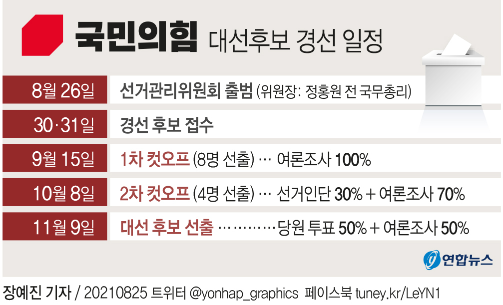
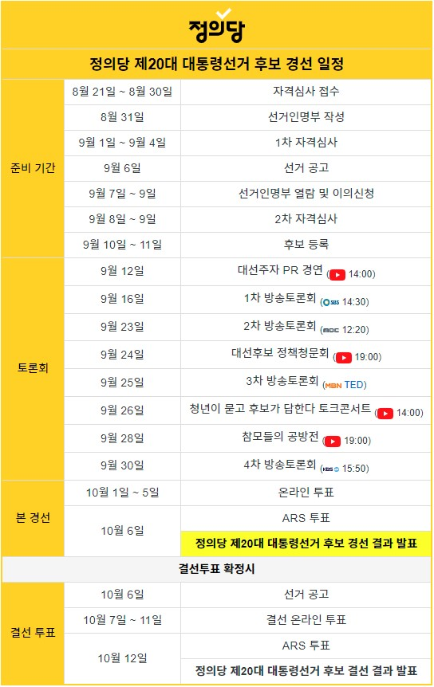

```{r setup, include=FALSE}
knitr::opts_chunk$set(echo = TRUE, message=FALSE, warning=FALSE,
                      comment="", digits = 3, tidy = FALSE, prompt = FALSE, fig.align = 'center')
library(tidyverse)
library(rvest)
library(lubridate)
```

# 각 정당 경선 일정 {#korean-party-schedule}

## 민주당 경선 일정 {#minju-race-schedule}

제20대 대통령 선거 YTN에서 작성한 [더불어민주당 대선후보 경선 일정](https://www.yna.co.kr/view/GYH20210830001600044)은 다음과 같다.

{width="458"}

## 국민의 힘 경선 일정 {#people-race-schedule}

제20대 대통령 선거 YTN에서 작성한 [국민의힘 대선후보 경선 일정](https://www.yna.co.kr/view/GYH20210825001100044)은 다음과 같다.

{width="551"}

## 정의당 경선 일정 {#justice-race-schedule}

제20대 대통령 선거 나무위키에 나온 [정의당 대선후보 경선 일정](https://namu.wiki/w/%EC%A0%9C20%EB%8C%80%20%EB%8C%80%ED%86%B5%EB%A0%B9%20%EC%84%A0%EA%B1%B0%20%EC%A0%95%EC%9D%98%EB%8B%B9%20%ED%9B%84%EB%B3%B4%20%EA%B2%BD%EC%84%A0)은 다음과 같다.




# 경선 달력 {#race-calendar}


```{r calendar-race}
Sys.setlocale(locale = "Korean")
library(tidyverse)
extrafont::loadfonts()

library(calendR)

start_date <- "2021-09-01"
end_date   <- "2021-10-31"

custom_dates <- seq(as.Date(start_date), as.Date(end_date), by = "1 day")
events <- rep(NA, length(custom_dates))

# Time difference
dif <- 360 - length(custom_dates)

minju_fills <- rep(NA, length(custom_dates))

minju_fills[c(270:280) - dif] <- "대전/충남"
minju_fills[300 - dif] <- "강원"

calendR(from = "2021-09-01",  # 경선 시작일
        to   = "2021-10-31",  # End date
        title = "제20대 대통령 선거", # 제목
        subtitle = "민주당 경선 일정",
        start = "M",                # 일요일 시작
        font.family = "NanumBarunGothic",
        font.style  = "plain",
        mbg.col = 4,               # Background color for the month names
        months.col = "white",      # Text color of the month names
        special.col = "lightblue", # Color of the special.days
        lty = 0,                   # Line type
        weeknames = c("월", "화", "수", "목",
                      "금", "토", "일"),
        title.size = 20,   # Title size
        subtitle.size = 15,   # Title size
        orientation = "p", # Portrait orientation
        bg.img = "fig/minju_logo_section.png")


```


