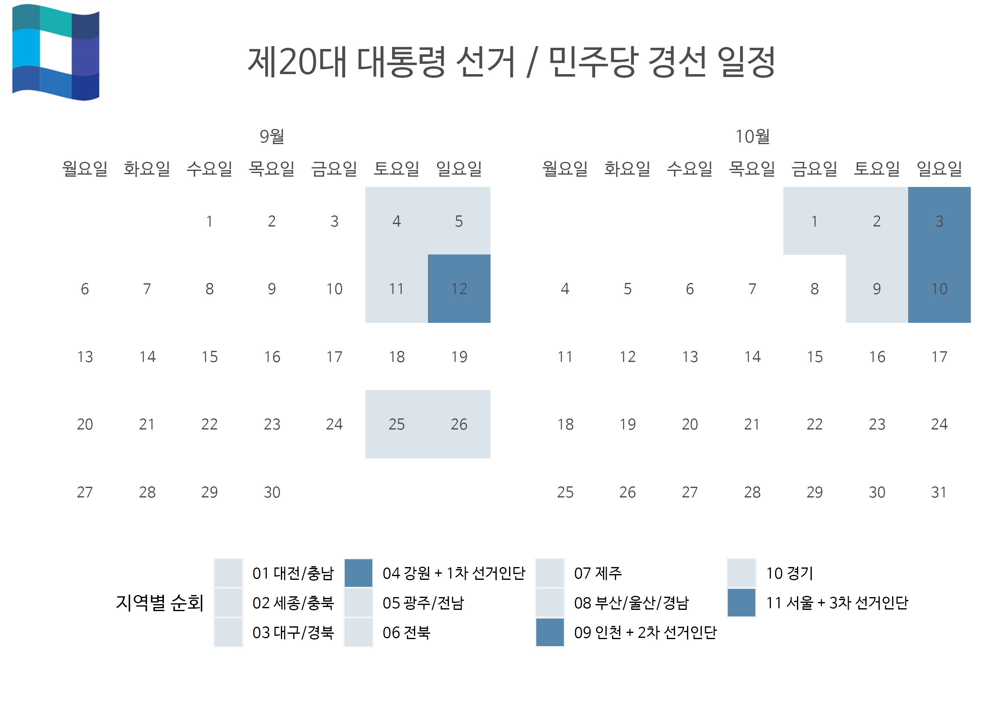

```{r setup, include=FALSE}
knitr::opts_chunk$set(echo = TRUE, message=FALSE, warning=FALSE,
                      comment="", digits = 3, tidy = FALSE, prompt = FALSE, fig.align = 'center')
library(tidyverse)
library(rvest)
library(lubridate)
```

# 각 정당 경선 일정 {#korean-party-schedule}

## 민주당 경선 일정 {#minju-race-schedule}

제20대 대통령 선거 YTN에서 작성한 [더불어민주당 대선후보 경선 일정](https://www.yna.co.kr/view/GYH20210830001600044)은 다음과 같다.

{width="458"}

## 국민의 힘 경선 일정 {#people-race-schedule}

제20대 대통령 선거 YTN에서 작성한 [국민의힘 대선후보 경선 일정](https://www.yna.co.kr/view/GYH20210825001100044)은 다음과 같다.

{width="551"}

## 정의당 경선 일정 {#justice-race-schedule}

제20대 대통령 선거 나무위키에 나온 [정의당 대선후보 경선 일정](https://namu.wiki/w/%EC%A0%9C20%EB%8C%80%20%EB%8C%80%ED%86%B5%EB%A0%B9%20%EC%84%A0%EA%B1%B0%20%EC%A0%95%EC%9D%98%EB%8B%B9%20%ED%9B%84%EB%B3%B4%20%EA%B2%BD%EC%84%A0)은 다음과 같다.


# 경선 달력 {#race-calendar}

민주당, 국민의 힘 경선달력을 제작하는 방식은 [`calendR`](https://github.com/R-CoderDotCom/calendR) 팩키지를 사용해서 PDF 파일로 내보내는 것도 가능하지만... 한국어 관련 내용이 완벽하지 않아 로고와 배경화면을 조합하여 배경을 만들어내고 각당 경선 일정을 `calendR`로 제작한다. `ggplot`으로 개발이 된 것이라 이를 png 파일로 찍어 `magick` 팩키지로 이미지 전처리를 통해 최종 결과물을 얻어낸다.


## 민주당 경선 달력 {#minju-race-calendar}

먼저 민주당 2021년 9월 달력을 제작해 보자.

```{r calendar-race}

Sys.setlocale(locale = "Korean")
library(tidyverse)
extrafont::loadfonts()
library(calendR)


# calendR(from = "2021-09-01",  # 경선 시작일
#         to   = "2021-10-31",  # End date
#         title = "제20대 대통령 선거", # 제목
#         subtitle = "민주당 경선 일정",
#         start = "M",                # 일요일 시작
#         font.family = "NanumBarunGothic",
#         font.style  = "plain",
#         mbg.col = 4,               # Background color for the month names
#         months.col = "white",      # Text color of the month names
#         special.days = c(daejeon, 5),
#         special.col = c("#3EA0E2", "#3EFFFF"),
#         text = c("Visit\nhttps://r-coder.com/"),
#         text.pos = c(1, 4, 5),
#         lty = 0,                   # Line type
#         weeknames = c("월", "화", "수", "목",
#                       "금", "토", "일"),
#         title.size = 20,   # Title size
#         subtitle.size = 15,   # Title size
#         orientation = "p", # Portrait orientation
#         bg.img = "fig/minju_logo_section.png",
#         low.col = "transparent")

events <- rep(NA, 30)


events[4]  <- "1 대전/충남"
events[5]  <- "2 세종/충북"
events[11] <- "3 대구/경북"
events[12] <- "4 강원 + 1차 선거인단"
events[25] <- "5 광주/전남"
events[26] <- "6 전북"
# events[31] <- "7 제주"

color_len <- levels(as.factor(events)) %>% length


calendR::calendR(from = "2021-09-01",  # 경선 시작일
        to   = "2021-09-30",  # End date
        title = "제20대 대통령 선거", # 제목
        subtitle = "민주당 경선 일정",
        start = "M",                # 월요일 시작
        font.family = "NanumBarunGothic",
        font.style  = "plain",
        special.days = events,
        special.col  = 1:6, 
        legend.pos = "right",   
        legend.title = "지역별 순회",
        lty = 0,
        gradient = FALSE)


```


이제 민주당 2021년 9월/10월 경선 전체 달력을 제작해 보자.

```{r calendar-race-minju}

events <- rep(NA, 61)

events[4]  <- "01 대전/충남"
events[5]  <- "02 세종/충북"
events[11] <- "03 대구/경북"
events[12] <- "04 강원 + 1차 선거인단"
events[25] <- "05 광주/전남"
events[26] <- "06 전북"
events[30 + 1] <- "07 제주"
events[30 + 2] <- "08 부산/울산/경남"
events[30 + 3] <- "09 인천 + 2차 선거인단"
events[30 + 9] <- "10 경기"
events[30 + 10] <- "11 서울 + 3차 선거인단"

p <- calendR::calendR(from = "2021-09-01",  # 경선 시작일
        to   = "2021-10-31",  # End date
        title = "제20대 대통령 선거 / 민주당 경선 일정", # 제목
        # subtitle = "민주당 경선 일정",
        start = "M",                # 월요일 시작
        font.family = "NanumBarunGothic",
        font.style  = "plain",
        special.days = events,
        special.col  = c("#DBE4EB", "#DBE4EB", "#DBE4EB", "#5787AD", 
                         "#DBE4EB", "#DBE4EB", "#DBE4EB", "#DBE4EB",
                         "#5787AD", "#DBE4EB", "#5787AD"),
        legend.title = "지역별 순회",
        legend.pos = "bottom",   
        lty = 0,
        gradient = FALSE)

p %>% 
  ggsave(filename = "fig/minju_race.png")
```

민주당 경선 달력의 배경 이미지를 준비해보자.

```{r minju-calendar-background}
# 달력 이미지 정보 획득 -- 가로 x 세로
library(magick)

minju_cal <- image_read("fig/minju_race.png")

minju_tbl <- image_info(minju_cal) 

# 달력을 놓을 백지 이미지 준비 ----------
blank_img <- image_blank(width  =  minju_tbl$width, 
                         height = minju_tbl$height,
                         color = "white")

# 민주당 로고 -----------

minju_logo <- image_read("fig/minju_logo_section.png")

# 배경과 로고 결합 -----------

minju_bg <- blank_img %>% 
  image_composite(minju_logo %>% image_resize("150%"),  offset = "+10+5")  %>% 
  image_transparent(color = "white")


minju_bg %>% 
  image_write(path = "fig/minju_bg.png")

```

민주당 경선 달력과 배경 이미지를 결합시키자.

```{r minju-bg-composite, eval = FALSE}
# minju_race_cal_g <- calendR::calendR(from = "2021-09-01",  # 경선 시작일
#         to   = "2021-10-31",  # End date
#         title = "제20대 대통령 선거 / 민주당 경선 일정", # 제목
#         # subtitle = "민주당 경선 일정",
#         start = "M",                # 월요일 시작
#         font.family = "NanumBarunGothic",
#         font.style  = "plain",
#         special.days = events,
#         special.col  = c("#DBE4EB", "#DBE4EB", "#DBE4EB", "#5787AD", 
#                          "#DBE4EB", "#DBE4EB", "#DBE4EB", "#DBE4EB",
#                          "#5787AD", "#DBE4EB", "#5787AD"),
#         legend.title = "지역별 순회",
#         legend.pos = "bottom",   
#         lty = 0,
#         gradient = FALSE,
#         bg.img = "fig/minju_bg.png",
#         low.col = "transparent") 

minju_cal_img <- image_read("fig/minju_race.png")

minju_race_cal_img <- minju_cal_img %>% 
  image_composite(minju_bg, operator = "atop")  

minju_race_cal_img %>% 
  image_write("fig/minju_race_cal.png")
```



## 국민의 힘 경선 달력 {#people-race-calendar}

이제 국민의 힘 경선 달력을 제작해보자.

```{r people-calendar-race}

people_events <- rep(NA, 91)

people_events[15]      <- "1차 컷오프(8명) \n 여론조사 100%"
people_events[30 + 8]  <- "2차 컷오프(4명) \n 여론조사 70% + 선거인단 30%"
people_events[61 + 9]  <- "대선후보 설출 \n 여론조사 50% + 당원 투표 50%"


people_race_cal <- calendR::calendR(from = "2021-09-01",  # 경선 시작일
        to   = "2021-11-30",  # End date
        title = "제20대 대통령 선거 / 국민의힘 경선  일정", # 제목
        subtitle = "\n\n\n\n\n",
        start = "M",                # 월요일 시작
        font.family = "NanumBarunGothic",
        font.style  = "plain",
        special.days = people_events,
        special.col  = c("#f27178", "#f27178", "#e61e2b"), 
        legend.pos = "bottom",   
        legend.title = "지역별 순회",
        weeknames = c("월", "화", "수", "목",
                      "금", "토", "일"),
        lty = 0,
        title.size = 20,  
        gradient = FALSE)

people_race_cal %>% 
  ggsave(filename = "fig/people_race_cal.png")

people_race_cal
```

국민의힘 로고를 배경 이미지로 놓아 경선 일정 달력을 놓을 수 있도록 준비한다.

```{r people-calendar-background}

people_race_cal <- image_read("fig/people_cal.png")

people_tbl <- image_info(people_race_cal) 

# 달력을 놓을 백지 이미지 준비 ----------
people_blank_img <- image_blank(width  = people_tbl$width, 
                                height = people_tbl$height,
                                color  = "white")

# 국민의힘 로고 -----------

people_logo <- image_read("fig/people_logo.jpg")

# 배경과 로고 결합 -----------

people_bg <- people_blank_img %>% 
  image_composite(people_logo %>% image_resize("100%"),  offset = "+10+5")  %>% 
  image_transparent(color = "white")

people_bg %>% 
  image_write(path = "fig/people_bg.png")

```

마지막으로 로고가 담긴 배경 이미지를 국민의 힘 경선 달력과 합쳐 마무리한다.


```{r people-bg-composite, eval = TRUE}

people_race_cal <- image_read("fig/people_race_cal.png")

people_race_cal_img <- people_race_cal %>% 
  image_composite(people_bg, operator = "atop")  

people_race_cal_img %>% 
  image_write("fig/people_race_cal_img.png")
```

