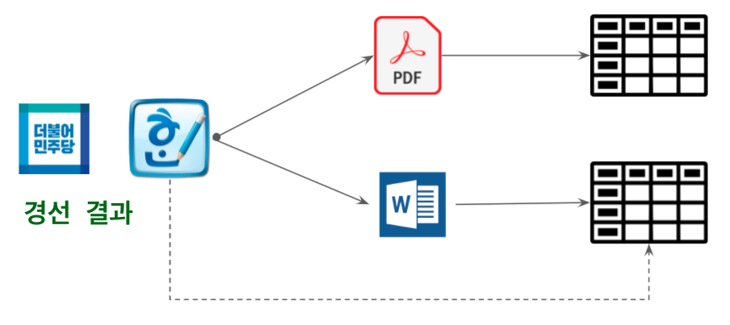
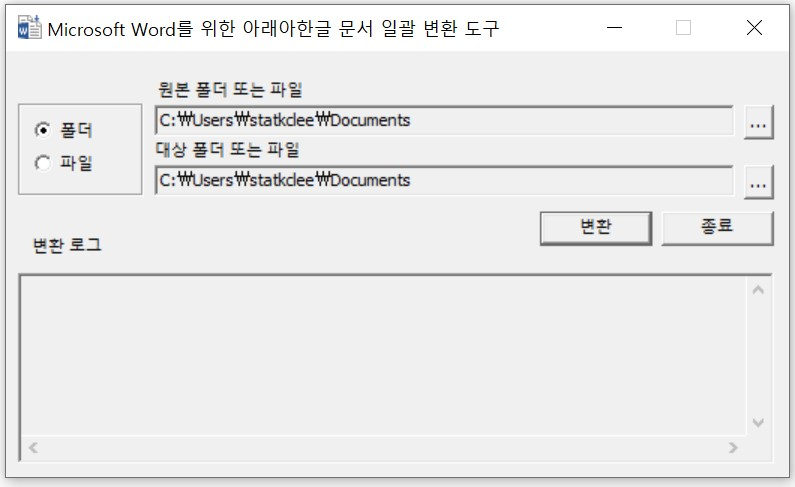
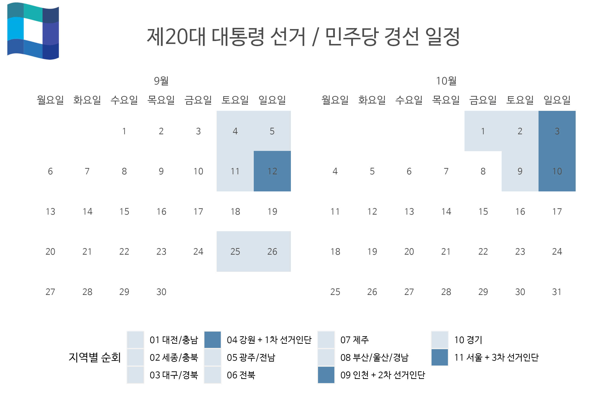

```{r setup, include=FALSE}
knitr::opts_chunk$set(echo = TRUE, message=FALSE, warning=FALSE,
                      comment="", digits = 3, tidy = FALSE, prompt = FALSE, fig.align = 'center')
library(tidyverse)
library(rvest)
library(lubridate)
```



# 민주당 경선 데이터 {#minju-race}

[민주당 보도자료](https://theminjoo.kr/board/lists/presskit)를 통해서 제 20 대 대선 후보자 선출을 위한 민주당 경선 데이터를 얻을 수 있다.

-   [210904\_대전충남제20대\_대선\_후보자\_선출\_위한\_결과\_보도자료](data/minju_race/210904_대전충남제20대_대선_후보자_선출_위한_결과_보도자료.pdf)
-   [210905\_(세종충북)\_제20대\_대선\_후보자\_선출\_위한\_결과\_보도자료](data/minju_race/210905_(세종충북)_제20대_대선_후보자_선출_위한_결과_보도자료_fn.pdf)
-   [210911\_대구경북\_제20대\_대선\_후보자\_선출\_위한\_결과\_보도자료](data/minju_race/210911_대구경북_제20대_대선_후보자_선출_위한_결과_보도자료.pdf)
-   [210912\_제20대\_대선후보자\_선출\_위한\_순회경선\_결과\_보도자료(강원)](data/minju_race/210912_제20대_대선후보자_선출_위한_순회경선_결과_보도자료(강원)_fn.pdf)

## HWP → PDF {#minju-race-hwp}

먼저 HWP 파일을 PDF로 변환시킨 후에 `tabulizer`에서 표를 추출한다.

```{r minju-data, eval = FALSE}
library(tidyverse)
library(tabulizer)

# locate_areas(file = "data/minju_race/210904.pdf", pages = 1)
# 선거인단
# Listening on http://127.0.0.1:4065
# [[1]]
#       top      left    bottom     right 
# 207.64360  58.57953 332.75103 538.15807 
# 경선결과
# [[1]]
#       top      left    bottom     right 
# 372.71591  55.10433 721.97417 538.15807 

# 대전충남_선거인단 <- extract_tables("data/minju_race/210904_대전충남제20대_대선_후보자_선출_위한_결과_보도자료.pdf",
대전충남_선거인단 <- extract_tables("data/minju_race/210904_대전충남제20대_대선_후보자_선출_위한_결과_보도자료.pdf",
                             pages = 1,
                             encoding = "UTF-8",
                             output = "data.frame",
                             method = "stream",
                             guess = TRUE,
                             area = list(c(207.64360, 58.57953, 332.75103, 538.15807)))

대전충남_선거결과 <- extract_tables("data/minju_race/210904_대전충남제20대_대선_후보자_선출_위한_결과_보도자료.pdf",
                             pages = 1,
                             encoding = "UTF-8",
                             method = "stream",
                             output = "data.frame",
                             guess = TRUE,
                             area = list(c(372.71591, 55.10433, 721.97417, 538.15807)))

```

앞서 해당 영역에서 추출한 표를 바탕으로 후처리 작업을 해서 데이터 분석과 시각화가 가능한 형태로 변환시킨다.

```{r 대전충남, eval = FALSE}

대전충남_tbl <- `대전충남_선거결과` %>% 
  .[[1]] %>% 
  janitor::clean_names(ascii=FALSE) %>% 
  set_names(c("기호", "후보자명", "전국대의원", "권리당원", 
"x", "유선전화", "합계")) %>% 
  select(-기호, -x, -합계) %>% 
  filter(후보자명 != "") %>% 
  pivot_longer(-후보자명, names_to = "구분", values_to = "득표") %>% 
  mutate(후보자명 = str_remove_all(후보자명, "\\s"))  %>% 
  mutate(득표 = parse_number(득표))
  
대전충남_tbl

```

## HWP → DOCX [^1] {#minju-race-hwp-docx}

[^1]: [한글문서파일 워드로 변환하기](https://blog.naver.com/PostView.nhn?isHttpsRedirect=true&blogId=jooyonas&logNo=221537785840&parentCategoryNo=35&categoryNo=&viewDate=&isShowPopularPosts=true&from=search)

HWP 파일에서 표를 추출하는 방식으로 [Microsoft Word를 위한 아래아한글 문서 변환 도구](https://www.microsoft.com/ko-kr/download/details.aspx?id=36772)를 PC에 설치한 다음 `C:\Program Files\Microsoft Office\Office15` 디렉토리 `BATHCHWPCONV.EXE` 파일을 실행시켜 워드 파일을 얻는 것이다.

{width="323"}

[`docxtractr`](https://cran.r-project.org/web/packages/docxtractr/index.html) 팩키지를 사용해서 워드파일에서 표를 추출한다.

### 대전 충청남도 {#minju-race-hwp-docx-충남}

```{r minju-data-docx}
library(docxtractr)
library(tidyverse)

choongnam_doc <- docxtractr::read_docx(path = "data/minju_race/210904.docx")

choongnam_vote_raw <- docx_extract_tbl(choongnam_doc, 2, header = FALSE)

choongnam_vote_tbl <- choongnam_vote_raw %>% 
  janitor::clean_names(ascii = FALSE) %>% 
  set_names(c("구분", "선거인수")) %>% 
  filter( str_detect(구분, "투표자|기권자|무효표")) %>% 
  mutate(선거인수 = parse_number(선거인수))

choongnam_vote_tbl %>% 
  write_rds("data/minju_race/choongnam_vote_tbl.rds")

## 대전 충남 선거결과 -----------------------------

choongnam_raw <- docx_extract_tbl(choongnam_doc, 3)

choongnam_tbl <- choongnam_raw %>% 
  janitor::clean_names(ascii = FALSE) %>% 
  set_names(c("기호", "후보자명", "전국대의원", "권리당원", "유선전화", "합계")) %>% 
  select(-기호, -합계) %>% 
  filter(후보자명 != "") %>% 
  pivot_longer(-후보자명, names_to = "구분", values_to = "득표") %>% 
  mutate(후보자명 = str_remove_all(후보자명, "\\s"))  %>% 
  mutate(득표 = parse_number(득표))

choongnam_tbl %>% 
  write_rds("data/minju_race/choongnam_tbl.rds")
```

### 세종 충청북도 {#minju-race-hwp-docx-충북}

```{r minju-충북}
choongbook_doc <- read_docx("data/minju_race/210905.docx")

choongbook_vote_raw <- docx_extract_tbl(choongbook_doc, 4, header = FALSE)

choongbook_vote_tbl <- choongbook_vote_raw %>% 
  janitor::clean_names(ascii = FALSE) %>% 
  set_names(c("구분", "선거인수", "x")) %>% 
  select(-x) %>% 
  filter( str_detect(구분, "투표자|기권자|무효표")) %>% 
  mutate(선거인수 = parse_number(선거인수)) 

choongbook_vote_tbl %>% 
  write_rds("data/minju_race/choongbook_vote_tbl.rds")

## 세종 충북 선거결과 -----------------------------

choongbook_raw <- docx_extract_tbl(choongbook_doc, 5)

choongbook_tbl <- choongbook_raw %>% 
  janitor::clean_names(ascii = FALSE) %>% 
  set_names(c("기호", "후보자명", "전국대의원", "권리당원", "유선전화", "합계")) %>% 
  select(-기호, -합계) %>% 
  filter(후보자명 != "") %>% 
  pivot_longer(-후보자명, names_to = "구분", values_to = "득표") %>% 
  mutate(후보자명 = str_remove_all(후보자명, "\\s"))  %>% 
  mutate(득표 = parse_number(득표))

choongbook_tbl %>% 
  write_rds("data/minju_race/choongbook_tbl.rds")
```

### 대구 경북 {#minju-race-hwp-docx-경북}

```{r minju-경북}
kyungbook_doc <- read_docx("data/minju_race/210911.docx")

kyungbook_vote_raw <- docx_extract_tbl(kyungbook_doc, 4, header = FALSE)

kyungbook_vote_tbl <- kyungbook_vote_raw %>% 
  janitor::clean_names(ascii = FALSE) %>% 
  set_names(c("구분", "선거인수", "x")) %>% 
  select(-x) %>% 
  filter( str_detect(구분, "투표자|기권자|무효표")) %>% 
  mutate(선거인수 = parse_number(선거인수)) 

kyungbook_vote_tbl %>% 
  write_rds("data/minju_race/kyungbook_vote_tbl.rds")

## 대구 경북 선거결과 -----------------------------

kyungbook_raw <- docx_extract_tbl(kyungbook_doc, 5)

kyungbook_tbl <- kyungbook_raw %>% 
  janitor::clean_names(ascii = FALSE) %>% 
  set_names(c("기호", "후보자명", "전국대의원", "권리당원", "유선전화", "합계")) %>% 
  select(-기호, -합계) %>% 
  filter(후보자명 != "") %>% 
  pivot_longer(-후보자명, names_to = "구분", values_to = "득표") %>% 
  mutate(후보자명 = str_remove_all(후보자명, "\\s"))  %>% 
  mutate(득표 = parse_number(득표))

kyungbook_tbl %>% 
  write_rds("data/minju_race/kyungbook_tbl.rds")
```

### 강원 {#minju-race-hwp-docx-강원}

```{r minju-강원}
kangwon_doc <- read_docx("data/minju_race/210912.docx")

kangwon_vote_raw <- docx_extract_tbl(kangwon_doc, 4, header = FALSE)

kangwon_vote_tbl <- kangwon_vote_raw %>% 
  janitor::clean_names(ascii = FALSE) %>% 
  set_names(c("구분", "선거인수", "x")) %>% 
  select(-x) %>% 
  filter( str_detect(구분, "투표자|기권자|무효표")) %>% 
  mutate(선거인수 = parse_number(선거인수)) 

kangwon_vote_tbl %>% 
  write_rds("data/minju_race/kangwon_vote_tbl.rds")

## 대구 경북 선거결과 -----------------------------

kangwon_raw <- docx_extract_tbl(kangwon_doc, 5, preserve=FALSE, trim = FALSE)

kangwon_tbl <- kangwon_raw %>% 
  janitor::clean_names(ascii = FALSE) %>% 
  set_names(c("기호", "후보자명", "전국대의원", "권리당원", "유선전화", "합계")) %>% 
  select(-기호, -합계) %>% 
  filter(후보자명 != "") %>% 
  pivot_longer(-후보자명, names_to = "구분", values_to = "득표") %>% 
  mutate(후보자명 = str_remove_all(후보자명, "\\s"))  %>% 
  mutate(득표 = parse_number(득표))

kangwon_tbl %>% 
  write_rds("data/minju_race/kangwon_tbl.rds")
```

# 민주당 경선 일정 {#minju-race}

민주당 경선은 지역을 순회하며 3차에 건친 선거인단 투표를 반영하는 구조를 갖고 있다. 
지역별 순회를 통해 지역별 후보 지지율과 1,2,3차에 걸친 선거인단 투표 결과를 함께 파악할 필요가 있다.



# 1차 지역 경선 (~9월12일) {#minju-race-hwp-docx-table}

선거인단은 전국대의원, 권리당원, 유선전화 신청 3가지로 구분되고 대다수를 차지하는 1,2,3차 슈퍼위크 국민/일반당원 투표로 나눠진다.

```{r 선거인단}
library(tidyverse)
library(reactable)

kangwon_vote_raw <- read_rds("data/minju_race/kangwon_vote_tbl.rds") 
choongbook_vote_raw <- read_rds("data/minju_race/choongbook_vote_tbl.rds")
choongnam_vote_raw <- read_rds("data/minju_race/choongnam_vote_tbl.rds")
kyungbook_vote_raw <- read_rds("data/minju_race/kyungbook_vote_tbl.rds")

kangwon_vote_tbl <- kangwon_vote_raw %>% 
  pivot_wider(names_from = "구분", values_from = "선거인수") %>% 
  mutate(시도 = "강원") %>% 
  select(시도, everything()) %>% 
  janitor::clean_names(ascii = FALSE)  %>% 
  set_names(c("시도", "투표자_수", "기권자_수", "무효표_수"))

preprocess_vote <- function(vote_tbl, sido) {
  
  vote_tbl %>% 
    pivot_wider(names_from = "구분", values_from = "선거인수") %>% 
    mutate(시도 = sido) %>% 
    select(시도, everything()) %>% 
    janitor::clean_names(ascii = FALSE)  %>% 
  set_names(c("시도", "투표자_수", "기권자_수", "무효표_수"))
  
}

강원_투표 <- preprocess_vote(kangwon_vote_raw, "강원")
경북_투표 <- preprocess_vote(kyungbook_vote_raw, "대구경북")
충남_투표 <- preprocess_vote(choongnam_vote_raw, "대전충남")
충북_투표 <- preprocess_vote(choongbook_vote_raw, "세종충북")

민주_투표 <- bind_rows(강원_투표, 경북_투표) %>% 
  bind_rows(충남_투표) %>% 
  bind_rows(충북_투표)

민주_투표 %>% 
  mutate(선거인수 = `투표자_수` + `기권자_수`,
         투표율   = `투표자_수` / `선거인수`) %>% 
  reactable::reactable(columns = list(
    `투표자_수` = colDef(format = colFormat(separators = TRUE, digits = 0)),
    `기권자_수` = colDef(format = colFormat(separators = TRUE, digits = 0)),
    `선거인수` = colDef(format = colFormat(separators = TRUE, digits = 0)),
    `투표율` = colDef(format = colFormat(percent = TRUE, digits = 1)))
  )
```

## 지역 경선 결과 {#minju-race-hwp-docx-경선결과}

먼저 4개 지역에서 득표한 결과를 종합하여 표로 누적 결과를 표시해보자.

```{r 지역경선결과}

kangwon_tbl <- read_rds("data/minju_race/kangwon_tbl.rds") %>% 
  mutate(시도 = "강원")
choongbook_rds <- read_rds("data/minju_race/choongbook_tbl.rds") %>% 
  mutate(시도 = "충북세종")
choongnam_tbl <- read_rds("data/minju_race/choongnam_tbl.rds") %>% 
  mutate(시도 = "충남대전")
kyungbook_tbl <- read_rds("data/minju_race/kyungbook_tbl.rds") %>% 
  mutate(시도 = "경북대구")

sofar_tbl <- bind_rows(kangwon_tbl, choongbook_rds) %>% 
  bind_rows(choongnam_tbl) %>% 
  bind_rows(kyungbook_tbl)

sofar_tbl %>% 
  group_by(후보자명) %>% 
  summarise(누적득표 = sum(득표)) %>% 
  ungroup() %>% 
  arrange(-누적득표) %>% 
  mutate(득표율 = 누적득표  / sum(누적득표)) %>% 
  reactable::reactable(columns = list(
    `누적득표` = colDef(format = colFormat(separators = TRUE, digits = 0)),
    `득표율` = colDef(format = colFormat(percent = TRUE, digits = 1)))
  ) 
```

민주당 경선에서 상위를 점하는 주요후보 3명을 색상을 달리하여 지역별로 득표한 득표수를 시각화한다.

```{r 지역경선-시각화}
extrafont::loadfonts()

sofar_tbl %>% 
  mutate(후보자명 = factor(후보자명, levels = c("이재명", "김두관", "정세균", "이낙연", "박용진", "추미애"))) %>% 
  mutate(시도     = factor(시도, levels = c("충남대전", "충북세종", "경북대구", "강원"))) %>% 
  ggplot(aes(x = 후보자명, y = 득표, fill = 후보자명)) +
    geom_col() +
    facet_wrap(~시도) +
    theme_bw(base_family = "NanumGothic") +
    theme(legend.position = "none",
          strip.text.x = element_text(size = 13, colour = "black", family = "NanumMyeongjo", face="bold"),
          strip.background=element_rect(fill="gray95"),
          plot.title=element_text(size=18, face="bold", family = "NanumBarunpen"),
          plot.subtitle=element_text(face="bold", size=13, colour="grey10", family = "NanumBarunpen")) +
    labs(x="",
         title = "제20대 대통령 선거 / 민주당 경선",
         subtitle = "9월 4/5/11/12일 지역순회 투표수",
         caption = "자료 출처: 더불어 민주당 보도자료, https://theminjoo.kr/board/lists/presskit") +
    scale_y_continuous(labels = scales::comma) +
    scale_fill_manual(values = c("blue", "gray", "gray", "red", "gray", "green"))
```


## 1차 국민 일반당원 결과 {#minju-race-hwp-docx-1차경선결과}

제20대 대선 후보자 선출 위한 1차 슈퍼위크(1차 국민·일반당원) 결과는 전체 선거인단 수도 많고 투표자도 많아 대선 후보 향방을 가르는 주요 지표가 된다.

```{r first-race-kangwon}

kangwon_doc <- read_docx("data/minju_race/210912.docx")

first_vote_raw <- docx_extract_tbl(kangwon_doc, 7, header = TRUE)

first_tbl <- first_vote_raw %>% 
  set_names(c("기호", "후보자명", "득표수", "X", "득표율")) %>% 
  select(-기호, -X) %>% 
  mutate(득표수 = parse_number(득표수),
         득표율 = parse_number(득표율) / 100)

first_tbl %>% 
  reactable::reactable(columns = list(
    `득표수` = colDef(format = colFormat(separators = TRUE, digits = 0)),
    `득표율` = colDef(format = colFormat(percent = TRUE, digits = 1)))
  ) 
```

## 지역 + 1차 국민 일반당원 {#minju-race-hwp-docx-1차경선결과-plus}

4개 지역 경선 득표 결과와 1차 국민 일반당원 결과를 하나로 합쳐 9월 12일까지 결과를 살펴보자.
9월 12일까지 지역 경선 득표와 1차 국민/일반당원 결과를 취합하여 다음과 같은 비율을 만들어 지역득표 대비 국민일반득표 비율을 산출해보자. 예를 들어 추미애 후보의 경우 지역득표보다 국민일반득표가 높아 "미애로합의바"(?) 마케팅이 나름 득표에 큰 도움이 되고 있다고 해석할 수도 있다.

$$\text{비율} = \frac{\text{국민일반득표}}{\text{지역득표}}$$

```{r sofar-first-race-kangwon}
sofar_first_tbl <- sofar_tbl %>% 
  group_by(후보자명) %>% 
  summarise(지역득표 = sum(득표)) %>% 
  ungroup() %>% 
  left_join(first_tbl %>% select(후보자명, 국민일반득표 = 득표수, - 득표율)) 

sofar_first_tbl %>% 
  mutate(비율 = 국민일반득표 / 지역득표) %>% 
  reactable::reactable(columns = list(
    `국민일반득표` = colDef(format = colFormat(separators = TRUE, digits = 0)),
    `지역득표` = colDef(format = colFormat(separators = TRUE, digits = 0)),
    `비율` = colDef(format = colFormat(separators = TRUE, digits = 1)))
  ) 

```

`gt` 팩키지로 좀더 아름다운 표를 제작해보자.

```{r sofar-first-race-kangwon-gt, layout="l-body-outset"}
library(gt)

sofar_first_tbl %>% 
  mutate(비율 = 국민일반득표 / 지역득표) %>% 
  gt() %>% 
  tab_header(
    title = md("**&#x2600; 제20대 대통령 선거 &#x2600;**"),
    subtitle = md("*더불어 민주당 경선*")
  ) %>% 
  tab_options(
    heading.background.color = "#1E61B0", # R logo 파란색
    heading.title.font.size = "20px",
    column_labels.background.color = "#F7F7F7", # R logo 회색 
    column_labels.font.weight = "bold",
    stub.background.color = "#ffffff",
    stub.font.weight = "bold"
  ) %>% 
  cols_align(
    align = "right",
    columns = -`후보자명`
  ) %>% 
  cols_align(
    align = "center",
    columns = `후보자명`
  ) %>% 
  fmt_number(
    columns = 비율,
    decimals = 1,
    use_seps = FALSE
  ) %>% 
  fmt_number(
    columns = c(지역득표, 국민일반득표),
    decimals = 0,
    suffixing = FALSE
  ) %>% 
  tab_source_note(
    source_note =  md("**자료출처**: 더불어 민주당 보도자료, https://theminjoo.kr/board/lists/presskit")
  ) %>% 
  data_color(
    columns = c(지역득표, 국민일반득표, 비율),
    colors = scales::col_numeric(
      palette = paletteer::paletteer_d(
        palette = "ggsci::blue_material"
        ) %>% as.character(),
      domain = NULL
      )
  )  %>% 
   tab_style(style = list(cell_text(weight = 'bold',
                                    size  = "large",
                                    color = "blue")), 
            locations = cells_body(columns = 후보자명, 
                                   rows = 후보자명 == "이재명")) %>% 
   tab_style(style = list(cell_text(decorate = "line-through")), 
            locations = cells_body(columns = 후보자명, 
                                   rows = 후보자명 == "정세균")) %>% 
   tab_style(style = list(cell_text(size  = "small")), 
            locations = cells_body(columns = 후보자명, 
                                   rows = 후보자명 != "이재명"))

```


상기 결과를 보기 좋은 형태로 시각화 해보자.

```{r sofar-first-race-kangwon-viz}
sofar_first_tbl %>% 
  pivot_longer(-후보자명, names_to = "구분", values_to = "득표") %>% 
  mutate(후보자명 = factor(후보자명, levels = c("이재명", "김두관", "정세균", "이낙연", "박용진", "추미애"))) %>% 
  ggplot(aes(x = 후보자명, y = 득표, fill = 후보자명)) +
    geom_col() +
    facet_wrap(~구분) +
    theme_bw(base_family = "NanumGothic") +
    theme(legend.position = "none",
          strip.text.x = element_text(size = 13, colour = "black", family = "NanumMyeongjo", face="bold"),
          strip.background=element_rect(fill="gray95"),
          plot.title=element_text(size=18, face="bold", family = "NanumBarunpen"),
          plot.subtitle=element_text(face="bold", size=13, colour="grey10", family = "NanumBarunpen")) +
    labs(x="",
         title = "제20대 대통령 선거 / 민주당 경선",
         subtitle = "9월 4/5/11/12일 지역순회 및 1차 국민·일반당원 득표수",
         caption = "자료 출처: 더불어 민주당 보도자료, https://theminjoo.kr/board/lists/presskit") +
    scale_y_continuous(labels = scales::comma) +
    scale_fill_manual(values = c("blue", "gray", "gray", "red", "gray", "green"))  
```

