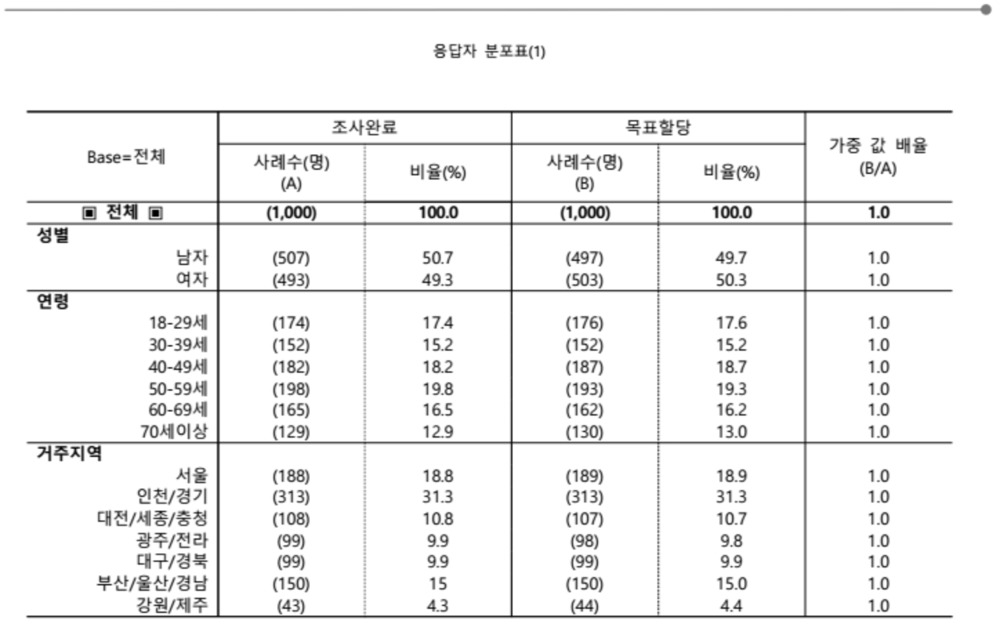
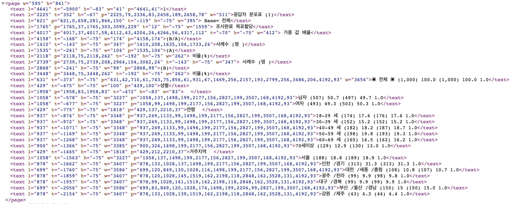

```{r setup, include=FALSE}
knitr::opts_chunk$set(echo = TRUE, message=FALSE, warning=FALSE,
                      comment="", digits = 3, tidy = FALSE, prompt = FALSE, fig.align = 'center')
library(tidyverse)
library(rvest)
library(lubridate)
```

# KBS 8145번 여론조사 {#kbs-survey-8145}

여론조사결과 등록현황 상세보기 KBS가 조사의뢰하고 (주)한국리서치가 조사기관우로 참여한 [정기(정례)조사,대통령선거,정당지지도 (전국 정기(정례)조사 대통령선거 정당지지도 정치, 사회현안 등 )](https://www.nesdc.go.kr/portal/bbs/B0000005/view.do?nttId=9005) 사례를 들어 데이터 추출방법을 살펴보자.

-   PDF → 이미지

    -   <https://www.nesdc.go.kr/files/result/202109/FILE_202109180931525561.pdf.htm>

-   이미지 파일

    -   <https://www.nesdc.go.kr/files/result/202109/FILE_202109180931525561.pdf.files/1.png>
    -   <https://www.nesdc.go.kr/files/result/202109/FILE_202109180931525561.pdf.files/2.png>
    -   ...
    -   <https://www.nesdc.go.kr/files/result/202109/FILE_202109180931525561.pdf.files/23.png>

-   XML 페이지 이미지 메타파일

    -   <https://www.nesdc.go.kr/files/result/202109/FILE_202109180931525561.pdf.files/FILE_202109180931525561.pdf.xml>

-   XML 페이지 텍스트 본문 <https://www.nesdc.go.kr/files/result/202109/FILE_202109180931525561.pdf.files/FILE_202109180931525561.pdf.text.xml>

## 페이지 메타 데이터 {#kbs-survey-8145-meta}

[XML 페이지 이미지 메타파일](https://www.nesdc.go.kr/files/result/202109/FILE_202109180931525561.pdf.files/FILE_202109180931525561.pdf.xml)에 포함된 XML 정보를 추후 작업이 가능한 형태로 데이터를 전처리 작업한다.

```{r xml-survey-meta}
library(tidyverse)
library(xml2)

kbs_meta <- read_xml("https://www.nesdc.go.kr/files/result/202109/FILE_202109180931525561.pdf.files/FILE_202109180931525561.pdf.xml")

kbs_meta %>% 
  xml_attrs("title")

kbs_meta_nodes <- xml_find_all(kbs_meta, "//page")

kbs_meta_attributes <- kbs_meta_nodes[[1]] %>% xml_attrs(.) %>% names()

kbs_meta_df <- xml_attrs(kbs_meta_nodes) %>% 
  list2DF() %>% 
  janitor::clean_names() 

row.names(kbs_meta_df)  <- kbs_meta_attributes

kbs_meta_tbl <- kbs_meta_df %>% 
  rownames_to_column(var = "attributes") %>% 
  pivot_longer(cols = -attributes)  %>% 
  pivot_wider(names_from = attributes, values_from = value) %>% 
  select(-name)

kbs_meta_tbl %>% 
  reactable::reactable()
```

## 여론조사결과 {#kbs-survey-8145-main}

여론조사 결과 본문을 페이지 단위로 추출하자.

+-------------------------------------+--------------------------------------------+
| {width="400"} | {width="400"}          |
+-------------------------------------+--------------------------------------------+

```{r xml-survey-main}

kbs_survey <- read_xml("https://www.nesdc.go.kr/files/result/202109/FILE_202109180931525561.pdf.files/FILE_202109180931525561.pdf.text.xml")

## KBS 여론조사 페이지 ------
kbs_survey_page <- kbs_survey %>% 
  xml_children()

xml_length(kbs_survey_page) %>% length

## 특정 페이지 : 응답자 분포표 값 --------------
xml_siblings(kbs_survey_page)[[3]] %>% 
  xml_children() %>% 
  xml_contents() %>% 
  as.character()

## 특정 페이지 : 응답자 분포표 좌표 --------------
table_h <- xml_siblings(kbs_survey_page)[[3]] %>% 
  xml_children() %>% 
  xml_attr("h")

table_w <- xml_siblings(kbs_survey_page)[[3]] %>% 
  xml_children() %>% 
  xml_attr("w")

table_l <- xml_siblings(kbs_survey_page)[[3]] %>% 
  xml_children() %>% 
  xml_attr("w")


```


# KBS 8145번 페이지 이미지 {#kbs-survey-8145-page}

## 여론조사 이미지 다운로드 {#kbs-survey-8145-page-download}

`<https://www.nesdc.go.kr/files/result/202109/FILE_202109180931525561.pdf.files/1.png>` 같은 형식이라 KBS 8145 여론조사 결과를 이미지로 받아 낼 수가 있다. 이를 위해서 `glue::glue()` 함수로 다운로드할 URI 주소를 특정하고 `download.file()` 함수를 사용해서 로컬 디렉토리에 저장한다.

```{r kbs-8145-images, eval = FALSE}

for(page in 1:23) {
  page_url <- glue::glue("https://www.nesdc.go.kr/files/result/202109/FILE_202109180931525561.pdf.files/{page}.png")
  print(page_url)
  download.file(url = page_url, destfile = glue::glue("data/nesdc/kbs/kbs_{page}.png"), mode = 'wb')
}

```

다운로드 결과는 `fs::dir_ls()` 함수를 사용해서 확인이 가능하다.

```{r install-sys-pkg}
fs::dir_ls("data/nesdc/kbs/")
```

다운로드 받은 여론조사결과를 일별할 수 있도록 쭉 살펴보자.

```{r filecheck}
library(tidyverse)
library(slickR)

kbs_pages <- fs::dir_ls("data/nesdc/kbs/")

kbs_tbl <- tibble(file_path = kbs_pages)

slickR(kbs_tbl$file_path, height = 600)
```

## XML 파일 파싱 {#kbs-xml-parsing}

특정 페이지에서 좌표값과 함께 해당 영역의 텍스트를 추출하는 로직을 구현해보자.

```{r xml-file-parsing}
library(xml2)
library(reactable)

kbs_survey <- read_xml("https://www.nesdc.go.kr/files/result/202109/FILE_202109180931525561.pdf.files/FILE_202109180931525561.pdf.text.xml")

## KBS 여론조사 페이지 ------
kbs_survey_page <- kbs_survey %>% 
  xml_children()

## 특정 페이지 : 목차 --------------
xml_siblings(kbs_survey_page)[[2]] %>% 
  xml_children() %>% 
  xml_contents() %>% 
  as.character()

## 특정 페이지 : 응답자 분포표 좌표 --------------
kbs_xml_tbl <- 
tibble(t = xml_siblings(kbs_survey_page)[[2]] %>% xml_children() %>% xml_attr("t"),      # t = top
       l = xml_siblings(kbs_survey_page)[[2]] %>% xml_children() %>% xml_attr("l"),      # l = left
       h = xml_siblings(kbs_survey_page)[[2]] %>% xml_children() %>% xml_attr("h"),      # h = height
       w = xml_siblings(kbs_survey_page)[[2]] %>% xml_children() %>% xml_attr("w"),      # w = width
       p = xml_siblings(kbs_survey_page)[[2]] %>% xml_children() %>% xml_attr("p"),      # p = paragraph(?)
       content = xml_siblings(kbs_survey_page)[[2]] %>% xml_children() %>% xml_contents() %>%  as.character()) %>% 
  mutate( t = as.numeric(t),
          l = as.numeric(l),
          h = as.numeric(h),
          w = as.numeric(w))

kbs_xml_tbl %>% 
  select(-p) %>% 
  reactable::reactable(
    columns = list(
      t = colDef(width = 80),
      l = colDef(width = 80),
      h = colDef(width = 80),
      w = colDef(width = 80)
    )
  )

```

## 페이지 이미지 겹쳐 확인 {#kbs-xml-parsing-check}

뭔가 좌표가 직관적이 아니라 이를 해결할 수 있는 방법을 찾아보자.


```{r xml-file-parsing-check}
library(magick)

kbs_xml_img <- image_read('data/nesdc/kbs/kbs_3.png')

kbs_xml_img_box <- image_draw(kbs_xml_img)

rect(xleft   = kbs_xml_tbl$l[2], 
     ytop    = kbs_xml_tbl$t[2], 
     xright  = kbs_xml_tbl$l[2] + kbs_xml_tbl$w[2]/10,
     ybottom = kbs_xml_tbl$t[2] + abs(kbs_xml_tbl$h[2]),
     border = "red", lty = "solid", lwd = 3)

dev.off()
```

