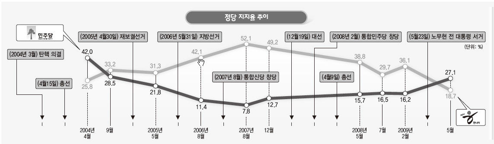

```{r setup, include=FALSE}
knitr::opts_chunk$set(echo = TRUE, message=FALSE, warning=FALSE,
                      comment="", digits = 3, tidy = FALSE, prompt = FALSE, fig.align = 'center')

```

# 데이터 {#data-party}

위키백과 [대한민국 정당 지지율](https://ko.wikipedia.org/wiki/대한민국의_정당_지지율) 웹사이트에서 대선 직전 정당 지지율 데이터를 가져온다.

## 제19대 {#party-19}

19대 대통령 대선일은 2017-05-09 일 이전 조사한 정당지지율 데이터를 가져온다.

```{r party-data-19}
library(tidyverse)
library(rvest)

# Sys.setlocale("LC_ALL", "C")
# 
# party_html <- read_html("https://ko.wikipedia.org/wiki/대한민국의_정당_지지율")
# 
# party_data <- party_html %>% 
#   html_node(xpath = '//*[@id="mw-content-text"]/div[1]/div[9]/div[2]/table') %>% 
#   html_table(fill = TRUE)
# 
# Sys.setlocale("LC_ALL", "Korean")
# 
# party_data %>%
#   write_rds("data/party_data.rds")

party_data <- read_rds("data/party_data.rds")

party_19_tbl <- party_data %>% 
  janitor::clean_names(ascii = FALSE) %>% 
  filter(str_detect(조사_기간, "2017년 5월 2주")) %>% 
  select(조사_기간, 민주당=더불어민주당, 새누리당, 국민의당, 바른정당=정의당, 정의당=na)
  
party_19_tbl
```

## 제18대 {#party-18}

제 18대 대통령 선거는 2012-12-19 로 이전 가장 가까운 갤럽 조사결과를 가져온다.
[Gallup](https://www.gallup.co.kr/gallupdb/report.asp)에서 조사결과를 PDF 파일로 다운로드 받아 이를 직접 입력한다.
조사 날짜는 "2012년 12월 3일" 이다.

```{r party-data-18}
party_18_tbl <- tribble(~"조사_기간", ~"새누리당", ~"민주통합당", ~"진보정의당", ~"통합진보당", ~"모름/없음",
        "2012년 12월 3일", "39%",  "30%", "1%", "2%", "27%")

party_18_tbl
```

## 제17대 {#party-17}

제 17대 대통령 선거는 2007-12-19 로 이전 가장 가까운 갤럽 조사결과를 가져온다.
[Gallup](https://www.gallup.co.kr/gallupdb/report.asp)에서 조사결과를 PDF 파일로 다운로드 받아 이를 직접 입력한다.
구글 검색을 통해 정당 지지율에 대한 2007년 데이터를 구할 수 없어 한겨레 신문사에서 [민주, 4년8개월만에 한나라에 지지율 앞서](https://www.hani.co.kr/arti/PRINT/357940.html)으로 갈음한다.


