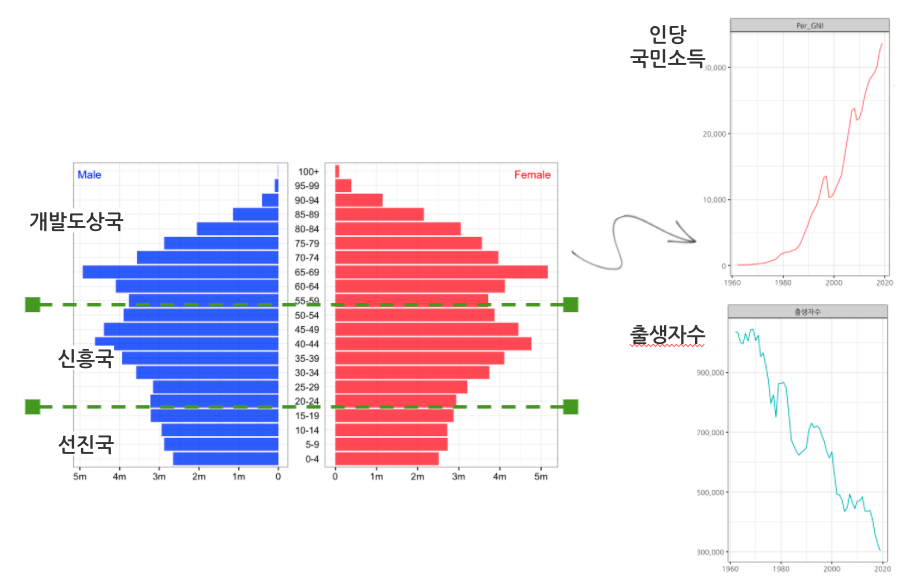

```{r setup, include=FALSE}
knitr::opts_chunk$set(echo = TRUE, message=FALSE, warning=FALSE,
                      comment="", digits = 3, tidy = FALSE, prompt = FALSE, fig.align = 'center')

```



# 인당 국민소득과 출생아수 {#gni-populations}

인당 국민소득과 출생아수에 대한 데이터 분석을 통해 해당 연도 출생한 시민이 선진국, 신흥국, 개발도상국 3가지 범주 중 어디에 속하고 인구 규모가 얼마인지 파악하는 것을 목표로 한다. 

## 인당 국민총소득 {#gni}

1인당 국민총소득 데이터를 [KOSIS](https://kosis.kr/statHtml/statHtml.do?orgId=101&tblId=DT_2AS017&conn_path=I2)에서 다운로드 받아 준비한다.

```{r download-excel}
library(tidyverse)
library(readxl)

world_tbl <- read_excel("data/1인당_국민총소득_20210516221455.xlsx")

gni_tbl <- world_tbl %>% 
  select(시점, Per_GNI = 한국) %>% 
  mutate(시점 = as.integer(시점))

gni_tbl %>% 
  reactable::reactable()
```


## 연도별 출생아수 {#birth}

위키백과 [대한민국의 인구](https://ko.wikipedia.org/wiki/대한민국의_인구)에서 년도별 출생자수를 구해낸다.

```{r population}
library(rvest)

pop_url <- "https://ko.wikipedia.org/wiki/대한민국의_인구"

pop_df <- pop_url %>% 
  read_html(encoding = "utf-8") %>% 
  html_node(xpath = '//*[@id="mw-content-text"]/div[1]/table[2]') %>% 
  html_table(fill = TRUE) %>% 
  as_tibble()

pop_tbl <- pop_df %>% 
  select(시점 = `연도 (년)`, 출생자수 = `출생자수(명)`) %>% 
  mutate(출생자수 = parse_number(출생자수))
```

## 인당 국민소득 출생아수 {#birth-income}

인당 국민소득은 1960년 통계가 잡힌 이후 꾸준히 늘고 있으나 출생자수는 급격히 감소하고 있는 것을 확인할 수 있다.
따라서, 인당 국민소득 증가는 출생자수 감소에 따른 분모가 줄어 국민소득이 상대적으로 증가하고 있는 것으로 볼 수도 있다.

```{r income-population}
korea_tbl <- left_join(gni_tbl, pop_tbl)

korea_tbl %>% 
  reactable::reactable()
```

```{r visualize-gdp-pop}
library(extrafont)
loadfonts()

korea_tbl %>% 
  pivot_longer(-시점, names_to = "key", values_to = "value") %>% 
  ggplot(aes(x=시점, y=value, color = key)) +
    geom_line() +
    facet_wrap(~key, scales = "free_y") +
    theme_bw(base_family = "NanumGothic") +
    theme(legend.position = "none") +
    labs(x="", y="") +
    scale_y_continuous(labels = scales::comma)
```


# 개도국, 신흥국, 선진국 구분 {#선진국}

## 코이카 기준 {#선진국-코이카}

코이카(KOICA)에서 발간한 "정보통신기술과 경제발전 개발도상국, 신흥국 그리고 선진국 비교하기" 참고용으로 제시한 보고서에서는 다음과 같은 기준으로 선진국, 신흥국, 개발도상국 3개 범주로 나누고 있다.

1. 6,500 달러 미만: 개발도상국 
1. 6,500달러 ~ 23,000 달러: 신흥국 
1. 23,000 달러 이상: 선진국

상기 기준을 명목 국민소득으로 나누게 되면 다음과 같이 출생자별로 구분이 가능하다.

```{r classify-countries}
korea_grp_tbl <- korea_tbl %>% 
  mutate(구분 = case_when(Per_GNI < 6500 ~ "개도국",
                          Per_GNI >= 2600 & Per_GNI < 23000 ~ "신흥국",
                          TRUE ~ "선진국")) %>% 
  mutate(구분 = factor(구분, levels = c("개도국", "신흥국", "선진국"))) 

korea_grp_tbl %>% 
  group_by(구분) %>% 
  summarise(출생자수 = sum(출생자수)) %>% 
  ungroup() %>% 
  mutate(비율 = 출생자수 / sum(출생자수))
```


## 국가 GDP 순위 {#gdp-ranking}

영문 위키백과 [List of countries by past and projected GDP (nominal)](https://en.wikipedia.org/wiki/List_of_countries_by_past_and_projected_GDP_(nominal)) 웹사이트에서 G7 및 GDP 점유율을 기준으로 한국이 전세계 GDP에서 기여하는 부분을 감안하여 한국이 개발도상국에서 신흥국으로 신흥국에서 선진국으로 올라선 년도를 특정해보자. 

```{r gdp-ranking}

gdp_url <- "https://en.wikipedia.org/wiki/List_of_countries_by_past_and_projected_GDP_(nominal)"

gdp_1970 <- gdp_url %>% 
  read_html() %>% 
  html_node(xpath = '//*[@id="mw-content-text"]/div[1]/table[1]/tbody/tr/td[2]/table') %>% 
  html_table(fill = TRUE) %>% 
  as_tibble()

gdp_1980 <- gdp_url %>% 
  read_html() %>% 
  html_node(xpath = '//*[@id="mw-content-text"]/div[1]/table[2]/tbody/tr/td[2]/table') %>% 
  html_table(fill = TRUE) %>% 
  as_tibble()

gdp_1990 <- gdp_url %>% 
  read_html() %>% 
  html_node(xpath = '//*[@id="mw-content-text"]/div[1]/table[3]/tbody/tr/td[2]/table') %>% 
  html_table(fill = TRUE) %>% 
  as_tibble()

gdp_2000 <- gdp_url %>% 
  read_html() %>% 
  html_node(xpath = '//*[@id="mw-content-text"]/div[1]/table[4]/tbody/tr/td[2]/table') %>% 
  html_table(fill = TRUE) %>% 
  as_tibble()

gdp_2010 <- gdp_url %>% 
  read_html() %>% 
  html_node(xpath = '//*[@id="mw-content-text"]/div[1]/table[5]/tbody/tr/td[2]/table') %>% 
  html_table(fill = TRUE) %>% 
  as_tibble()

# 데이터 결합 ------------------------------
gdp_df <- left_join(gdp_2010, gdp_2000) %>% 
  left_join(gdp_1990) %>% 
  left_join(gdp_1980) %>% 
  left_join(gdp_1970)

gdp_tbl <- gdp_df %>% 
  pivot_longer(`2010`:`1979`, names_to = "year", values_to = "GDP") %>% 
  rename(country = `Country (or dependent territory)`) %>% 
  mutate_at( vars(c("year", "GDP")), parse_number) 
```


## 대한민국 GDP 순위 {#korea-ranking}

G7국가와 대한민국, 중국을 중요국가로 특정하여 GDP 순위변화를 시각화 한다.

```{r gdp-ranking-korea}

G7 <- c("Canada", "France", "Germany", "Italy", "Japan", "United Kingdom", "United States")

gdp_tbl <- gdp_tbl %>% 
  mutate(G7 = case_when(country %in% G7 ~ "G7",
                           country == "South Korea" ~ "대한민국",
                           country == "China" ~ "중국",
                           TRUE ~ "기타")) %>% 
  mutate(G7 = factor(G7, levels=c("G7", "대한민국", "중국", "기타")))

gdp_ranking_gg <- gdp_tbl %>%   
    group_by(year) %>% 
  mutate(ranking = min_rank(-GDP)) %>%
  ggplot(aes(x=year, y=ranking, group = country, color = G7)) +
    geom_line() +
    scale_y_continuous(trans = "reverse") +
    scale_color_manual(values = c("midnightblue", "blue", "red", "grey")) +
    theme_minimal(base_family = "NanumGothic") +
    theme(legend.position = "top") +
    labs(x = "", 
         y = "GDP 순위",
         title = "연도별 GDP 국가별 순이 변동 추이")

gdp_ranking_gg
```

너무나도 많은 국가가 있기 때문에 GDP 상위 30개 국가만 선발하여 확대한다.

```{r top-ranking}
ggplot_ranking_top_gg <- gdp_ranking_gg +
  theme( panel.background = element_rect(fill = "white",
                                         size = 0.5, linetype = "solid")) +
  coord_cartesian(ylim=c(30,1)) +
  labs(title = "GDP 상위 30개국")

ggplot_ranking_top_gg
```

전체적인 흐름과 G7, 중국, 대한민국을 비롯한 30개 국가를 따로 시각화한 것을 두가지 그래프를 하나로 합쳐 `inset` 큰 그림지도 속에 삽입된 삽도(삽화)로 시각화한다.

```{r top-ranking-plus}

gdp_ranking_gg +
  annotation_custom(ggplotGrob(ggplot_ranking_top_gg  +
                                 theme(legend.position = "none") +
                                 labs(title = "")), 
                    xmin = 1967, xmax = 1995, 
                    ymin = -210, ymax = -70)

```

## G7 GDP 변화 {#korea-ranking}

G7 국가가 전세계 GDP에서 차지하는 비중을 계산해 내고 이를 시각화하여 한눈에 살펴볼 수 있도록 작업한다. 
먼저 G7 국가를 하나로 두고 비중을 살펴보면 2000년을 기준으로 줄기 시작하여  현재는 50% 아래로 내려간 것을 확인할 수 있다.

```{r G7-proportion}
gdp_g7_tbl <- gdp_tbl %>% 
  mutate(G7 = case_when(country %in% c("Canada", "France", "Germany", "Italy", "Japan", "United Kingdom", "United States") ~ "G7",
                        TRUE            ~ "기타")) %>% 
  mutate(G7 = factor(G7, levels=c("G7", "기타"))) %>% 
  group_by(year, G7) %>% 
  summarise(GDP = sum(GDP, na.rm = TRUE)) %>% 
  ungroup() 


gdp_g7_tbl %>% 
  pivot_wider(names_from = G7, values_from = GDP) %>% 
  mutate(G7점유율 = G7 / (G7 + 기타)) %>% 
  ggplot(aes(x = year, y = G7점유율)) +
    geom_area(fill = "lightblue") +
    scale_y_continuous(limits = c(0,1), labels = scales::percent) +
    geom_hline(yintercept = 0.5, linetype = 2) +
    theme_minimal(base_family = "NanumGothic") +
    labs(x     = "",
         title = "전세계 GDP 중 G7 점유율 (%)") 
```

G7국가를 쪼개 대한민국과 함께 GDP 점유율을 시각화한다.

```{r G7-proportion-by-country}
gdp_country_tbl <- gdp_tbl %>% 
  mutate(G7 = case_when(! country %in% c("Canada", "France", "Germany", "Italy", "Japan", "United Kingdom", "United States", "South Korea") ~ "기타",
                        TRUE            ~  country)) %>% 
  group_by(year, G7) %>% 
  summarise(GDP = sum(GDP, na.rm = TRUE)) %>% 
  ungroup() 

G7_korea_GDP_gg <- gdp_country_tbl %>% 
  group_by(year) %>% 
  mutate(GDP_sum = sum(GDP)) %>% 
  mutate(GDP_점유율 = GDP / GDP_sum) %>% 
  ungroup() %>% 
  select(year, G7, GDP_점유율) %>% 
  mutate(G7 = factor(G7, levels = c("United States", "Japan", "Germany", "France", "Canada", "Italy", "United Kingdom", "기타", "South Korea"))) %>% 
  ggplot(aes(x = year, y = GDP_점유율, group = G7)) +
    geom_area(aes(fill = G7)) +
    scale_y_continuous(limits = c(0,1), labels = scales::percent) +
    geom_hline(yintercept = 0.5, linetype = 2) +
    theme_minimal(base_family = "NanumGothic") +
    labs(x     = "",
         title = "전세계 GDP 중 G7 점유율 (%)") +
    scale_fill_viridis_d() +
    theme(legend.position = "right") +
    guides(fill = guide_legend(nrow = 9))

G7_korea_GDP_gg
```

대한민국이 전세계 GDP 기여분이 늘어나는 시점이 1980년, 1998년 두가지 시점이 눈에 띄고 이를 기점으로 1980년 이전은 개발도상국, 1980년에서 1998년 사이는 신흥국, 1998년 이후는 선진국으로 나눠볼 수 있다.

```{r G7_korea_GDP_gg}
G7_korea_GDP_gg +
  geom_vline(xintercept = 1980, color = "red", linetype = 3) +
  geom_vline(xintercept = 1998, color = "red", linetype = 3)
```

